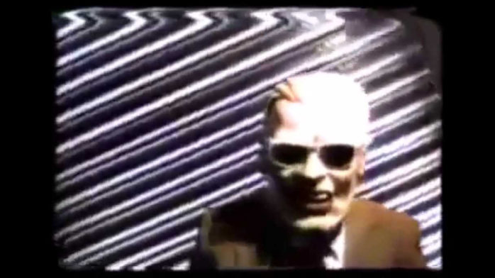

    Share this on &rarr;
    [<a title="Share on Mastodon" href="https://tootpick.org/#text=Check%20out%20https://sysfatal.github.io{{  page.url }}%20by%20@esoriano@social.linux.pizza">Mastodon</a>]
    [<a href="https://twitter.com/intent/tweet?text={{ page.title }}&url={{ site.url }}{{ page.url }}&via=e__soriano&related=e__soriano" rel="nofollow" target="_blank" title="Share on Twitter">Twitter</a>]
    [<a href="https://facebook.com/sharer.php?u={{ site.url }}{{ page.url }}" rel="nofollow" target="_blank" title="Share on Facebook">Facebook</a>]

 

<figure class="image">
  
  <figcaption>Max Headroom: hackeo de la señal de TV, Chicago, 1987.</figcaption>
</figure>

En los últimos años se han estado aplicando distintas técnicas de
inteligencia artificial con distintos fines y en múltiples contextos. Una
de sus aplicaciones es la creación de vídeos y voces sintéticas. Por
ejemplo, se denomina Deep Fake a la creación de vídeos falsificados
creados con tecnología de aprendizaje máquina (Machine Learning)
en los que se suplanta el rostro del sujeto del video original con el
rostro de otra persona elegida por el creador del video falso (ver por
ejemplo [1]). Es habitual encontrar este tipo de vídeos en las redes
sociales y se están haciendo muy populares a través de programas de
televisión. En general, se realizan como meras demostraciones o con
fines humorísticos, pornográficos o difamatorios [2].

Hace décadas, sólo ciertos actores podían acaparar la atención
del público (medios de comunicación relativamente confiables y
estados). Después de la revolución de la información con Internet, esto
ya no es así. Las redes sociales permiten la distribución prácticamente
sin control de todo tipo de contenido audiovisual, incluyendo noticias
falsas (Fake News) y Deep Fakes.

Estas noticias falsas tienen el objetivo de manipular a grupos de
personas (con un perfil más o menos definido), normalmente con objetivos
políticos, sociales o religiosos. El potencial de los Deep Fakes en
ese sentido es enorme, y sus consecuencias, imprevisibles.

Por ejemplo, Suwajanakorn et al. sintetizaron como prueba de concepto un
vídeo de alta calidad de Barack Obama en el que se falsea su discurso
usando una red neuronal recurrente con el fin de adaptar el audio falso
a las formas de la boca y labios del presidente [3]. Resulta imposible
calcular el impacto que tendría la distribución de un video similar
destinado a la manipulación y propaganda política.

<iframe allowfullscreen="" frameborder="0" height="270" src="https://www.youtube.com/embed/9Yq67CjDqvw" width="480"></iframe>

 

Estos vídeos tienen una gran capacidad para distorsionar la realidad
(presente y pasada). Otro vídeo sintético falso presentado recientemente
muestra a Nixon comunicando la muerte de la tripulación de la primera
misión a la Luna. Un vídeo similar creado con intenciones maliciosas
puede potenciar enormemente ciertas teorías de la conspiración y
falsear la historia real.

<iframe allowfullscreen="" frameborder="0" height="270" src="https://www.youtube.com/embed/yaq4sWFvnAY" width="480"></iframe>

 

Algunos autores [4] opinan que los Deep Fakes suponen un gran riesgo
para la sociedad, el sistema y la seguridad nacional porque pueden crear
distorsiones en el discurso democrático (cuyo requisitorio es que exista
un universo común de hechos y verdades empíricamente comprobables)
y minar la diplomacia. Prueba de ello es que DARPA, del Departamento
de Defensa de los Estados Unidos, está destinando recursos a la
investigación sobre el análisis y la detección de vídeos sintéticos
[5, 6, 7].

Hasta finales de la década de 1990, los efectos especiales digitales
no proporcionaban calidad suficiente como para poder pasar por videos
reales. A partir de esa década, los efectos especiales digitales llegaron
a tener la calidad suficiente, pero su creación no era automática y
requerían un presupuesto considerable (p. ej. grandes producciones
cinematográficas). Con los años, los costes se redujeron y ya era
posible crear estos efectos especiales con un presupuesto modesto. En
cualquier caso, su creación seguía siendo manual y requería
especialización, dedicación y tiempo.

La irrupción de la inteligencia artificial para la creación de videos
falsificados cambia esta situación. Actualmente es posible crear este
tipo de vídeos con aplicaciones gratuitas que ejecutan en ordenadores
de propósito general y no requieren ningún tipo de especialización
(p. ej. ver la aplicación FakeApp). Existen también aplicaciones para
móviles que, a partir de un retrato, generan vídeos sintéticos con
escenas de películas populares [8]. Aunque todavía es relativamente
sencillo distinguir a simple vista los vídeos falsos creados por usuarios
no especializados, se está llegando a un alto nivel de sofisticación
en la creación de vídeos sintéticos [9, 10, 11, 12, 13, 14, 15].

Teniendo en cuenta la evolución tecnológica en general, y en particular
en el área de la inteligencia artificial (p. ej. el hardware destinado a
la ejecución de redes neuronales), es razonable pensar que en un futuro
cercano será posible la generación automática de vídeos sintéticos
que resulten indistinguibles de vídeos reales, tanto para un espectador
como para un análisis forense convencional. Autores como Dan Boneh (ACM
Prize in Computing, Gödel Prize) consideran que en el futuro no seremos
capaces de distinguir humanos de máquinas (que denomina Sophisbots) y
tenemos que empezar a establecer límites y medidas (técnicas y legales)
[16].

De la misma forma, la síntesis de voz usando técnicas de inteligencia
artificial también ha experimentado un gran avance en los últimos
años. Hoy en día existen distintos sistemas de este tipo, como MelNet
de Facebook AI Research Lab [17], Deep Voice de Baidu [18] y WaveNet
de Google DeepMind [19], que permiten sintetizar un discurso imitando
una voz real de un humano seleccionado. Estos sistemas se entrenan con
muestras reales de una voz, para después poder sintentizar cualquier
discurso imitándola. Igual que en el caso de los vídeos falsos, la voz
sintentizada por los sistemas actuales no es perfecta. Pero de la misma
forma, es razonable pensar que en un futuro cercano puedan alcanzar una
calidad suficiente como para ser indistinguibles de la voz real.

En estos casos, la tecnología está avanzando a un ritmo tal que la
sociedad no puede asimilarla. Hoy en día, una grabación de vídeo
sigue siendo una evidencia de un hecho para la gran mayoría de personas,
aún siendo conscientes de que los efectos especiales tradicionales ya
permitían crear vídeos falsos (y que hoy en día es mucho más sencillo
falsificar audio y vídeo en un ordenador convencional). En general,
no se cuestiona la autenticidad de los videos con discursos hablados
que se pueden encontrar en redes sociales y servicios de streaming. Como
sociedad, vamos a tardar tiempo en asimilar que un vídeo de calidad en
el que se ve y escucha un supuesto hecho reciente puede que, en realidad,
sea un vídeo totalmente sintético. Cuando esto suceda, el problema
será que ningún vídeo real se considerará real. Los primeros efectos
ya se están haciendo visibles [20].

Boneh et al. [16] identifican tres aproximaciones distintas para luchar
contra Sophisbots que puedan generar vídeos sintetizados: el análisis
forense de los vídeos (i.e. la detección de material audiovisual
sintético), la identificación y autenticación de la procedencia
del contenido (usar cámaras que firmen los vídeos que generan) y
la auditoría total (grabar con una cámara personal toda la vida de
un sujeto).

Actualmente, la principal línea de investigación se centra en la
primera aproximación. Google y Facebook están creando bases de datos
de vídeos sintéticos para crear este tipo de herramientas [27]. Incluso
los pioneros en la creación de Deep Fakes están trabajando actualmente
para mitigar el riesgo [28].

Ya existen múltiples trabajos recientes para detectar de forma
automática material audiovisual sintentizado [6, 21, 22, 23, 24, 25,
26]. Se pueden seguir distintas aproximaciones para ello. Por ejemplo,
algunas utilizan técnicas de inteligencia artifical, como el trabajo
realizado por Guerra et al. [24] en el que se usa redes neuronales
recurrentes para detectar Deep Fakes. Korshunov et al. intentan detectar
inconsistencias en el discurso [26], mientras que Yuezun et al. se
enfocan en detectar anomalías en el parpadeo del sujeto [25].

La segunda aproximación tiene problemas de difícil solución: la
distribución de claves, la edición de vídeo (p. ej. antes de su
emisión) y el ataque denominado analog hole, que consiste en filmar la
reproducción de un vídeo sintetizado con una cámara que pueda firmarlo
como autentico [16].

Evidentemente, la tercera aproximación no es viable por motivos de
privacidad.

En resumen, no es disparatado pensar que en un futuro cercano será
posible falsear cualquier tipo de discurso hablado con vídeos sintéticos
hiperrealistas y robustos creados de forma automática con herramientas a
la disposición de actores sofisticados (p. ej. estados) y no sofisticados
(p. ej. cualquier usuario no especializado).

Ahora mismo, estoy trabajando en una propuesta que no encaja con ninguna
de las tres aproximaciones explicadas anteriormente… ya iré contando.

## Referencias

[1]
&nbsp;&nbsp;&nbsp;“Bloomberg: It’s getting harder to spot a deep fake video.” YouYube video, Dec.
2018. <a href="https://www.youtube.com/watch?v=gLoI9hAX9dw">Link</a>.&nbsp;

 

[2]
&nbsp;&nbsp;&nbsp;“An  ai  app  that  “undressed”  women  shows  how  deepfakes  harm  the  most
vulnerable.” MIT Technology Review, June 2019. <a href="https://www.technologyreview.com/s/613898/an-ai-app-that-undressed-women-shows-how-deepfakes-harm-the-most-vulnerable/">Link</a>.&nbsp;

 

[3]
&nbsp;&nbsp;&nbsp;S.&nbsp;Suwajanakorn,  S.&nbsp;M.  Seitz,  and  I.&nbsp;Kemelmacher-Shlizerman,  “Synthesizing
obama: Learning lip sync from audio,” ACM Trans. Graph., vol.&nbsp;36, pp.&nbsp;95:1–95:13,
July 2017.

 

[4]
&nbsp;&nbsp;&nbsp;R.&nbsp;Chesney and D.&nbsp;K. Citron, “Deep fakes: A looming challenge for privacy,
democracy, and national security,” California Law Review (2019), 2019. <a href="https://papers.ssrn.com/sol3/papers.cfm?abstract_id=3213954">Link</a>.

 

[5]
&nbsp;&nbsp;&nbsp;“The defense department has produced the first tools for catching deepfakes.” MIT
Technology Review, Aug. 2018. <a href="https://www.technologyreview.com/s/611726/the-defense-department-has-produced-the-first-tools-for-catching-deepfakes/">Link</a>.&nbsp;

 

[6]
&nbsp;&nbsp;&nbsp;“Defense advanced research projects agencyprogram information, media forensics
(medifor).” DARPA projects, Sept. 2019. <a href="https://www.darpa.mil/program/media-forensics">Link</a>.&nbsp;

 

[7]
&nbsp;&nbsp;&nbsp;“Three threats posed by deepfakes that technology won’t solve.” MIT Technology
Review, Oct. 2019. <a href="https://www.technologyreview.com/s/614446/deepfake-technology-detection-disinformation-harassment-revenge-porn-law/">Link</a>.&nbsp;

 

[8]
&nbsp;&nbsp;&nbsp;“An ai app that turns you into a movie star has risked the privacy of millions.”
MIT Technology Review, Sept. 2019. <a href="https://www.technologyreview.com/f/614258/ai-app-in-china-makes-you-movie-star-risks-privacy/">Link</a>.&nbsp;

 

[9]
&nbsp;&nbsp;&nbsp;P.&nbsp;Isola, J.-Y. Zhu, T.&nbsp;Zhou, and A.&nbsp;A. Efros, “Image-to-image translation with
conditional adversarial networks,” in Proceedings of the IEEE conference on computer
vision and pattern recognition, pp.&nbsp;1125–1134, 2017.&nbsp;

 

[10]
&nbsp;&nbsp;&nbsp;I.&nbsp;Korshunova,  W.&nbsp;Shi,  J.&nbsp;Dambre,  and  L.&nbsp;Theis,  “Fast  face-swap  using
convolutional neural networks,” in Proceedings of the IEEE International Conference
on Computer Vision, pp.&nbsp;3677–3685, 2017.&nbsp;

 

[11]
&nbsp;&nbsp;&nbsp;Y.&nbsp;Nirkin,  I.&nbsp;Masi,  A.&nbsp;T.  Tuan,  T.&nbsp;Hassner,  and  G.&nbsp;Medioni,  “On  face
segmentation, face swapping, and face perception,” in 2018 13th IEEE International
Conference on Automatic Face &amp; Gesture Recognition (FG 2018), pp.&nbsp;98–105, IEEE,
2018.&nbsp;

 

[12]
&nbsp;&nbsp;&nbsp;H.&nbsp;X. Pham, Y.&nbsp;Wang, and V.&nbsp;Pavlovic, “Generative adversarial talking head:
Bringing portraits to life with a weakly supervised neural network,” arXiv preprint
arXiv:1803.07716, 2018.

 

[13]
&nbsp;&nbsp;&nbsp;J.&nbsp;Thies,   M.&nbsp;Zollhofer,   M.&nbsp;Stamminger,   C.&nbsp;Theobalt,   and   M.&nbsp;Nießner,
“Face2face: Real-time face capture and reenactment of rgb videos,” in Proceedings of
the IEEE Conference on Computer Vision and Pattern Recognition, pp.&nbsp;2387–2395,
2016.&nbsp;

 

[14]
&nbsp;&nbsp;&nbsp;H.&nbsp;Kim,  P.&nbsp;Carrido,  A.&nbsp;Tewari,  W.&nbsp;Xu,  J.&nbsp;Thies,  M.&nbsp;Niessner,  P.&nbsp;Pé´erez,
C.&nbsp;Richardt,   M.&nbsp;Zollhöfer,   and   C.&nbsp;Theobalt,   “Deep   video   portraits,”   ACM
Transactions on Graphics (TOG), vol.&nbsp;37, no.&nbsp;4, p.&nbsp;163, 2018.&nbsp;

 

[15]
&nbsp;&nbsp;&nbsp;T.&nbsp;Karras, T.&nbsp;Aila, S.&nbsp;Laine, and J.&nbsp;Lehtinen, “Progressive growing of gans for
improved quality, stability, and variation,” arXiv preprint arXiv:1710.10196, 2017.&nbsp;

 

[16]
&nbsp;&nbsp;&nbsp;D.&nbsp;Boneh, A.&nbsp;J. Grotto, P.&nbsp;McDaniel, and N.&nbsp;Papernot, “How relevant is the
turing test in the age of sophisbots?,” 2019.&nbsp;

 

[17]
&nbsp;&nbsp;&nbsp;S.&nbsp;Vasquez and M.&nbsp;Lewis, “Melnet: A generative model for audio in the frequency
domain,” 2019.&nbsp;

 

[18]
&nbsp;&nbsp;&nbsp;S.&nbsp;O. Arik, M.&nbsp;Chrzanowski, A.&nbsp;Coates, G.&nbsp;Diamos, A.&nbsp;Gibiansky, Y.&nbsp;Kang,
X.&nbsp;Li,  J.&nbsp;Miller,  A.&nbsp;Ng,  J.&nbsp;Raiman,  S.&nbsp;Sengupta,  and  M.&nbsp;Shoeybi,  “Deep  voice:
Real-time neural text-to-speech,” 2017.&nbsp;

 

[19]
&nbsp;&nbsp;&nbsp;A.&nbsp;van&nbsp;den Oord, S.&nbsp;Dieleman, H.&nbsp;Zen, K.&nbsp;Simonyan, O.&nbsp;Vinyals, A.&nbsp;Graves,
N.&nbsp;Kalchbrenner, A.&nbsp;Senior, and K.&nbsp;Kavukcuoglu, “Wavenet: A generative model for
raw audio,” 2016.&nbsp;

 

[20]
&nbsp;&nbsp;&nbsp;“The biggest threat of deepfakes isn’t the deepfakes themselves.” MIT Technology
Review, Oct. 2019. <a href="https://www.technologyreview.com/s/614526/the-biggest-threat-of-deepfakes-isnt-the-deepfakes-themselves/amp/?__twitter_impression=true">Link</a>. 

 

[21]
&nbsp;&nbsp;&nbsp;X.&nbsp;Yang, Y.&nbsp;Li, and S.&nbsp;Lyu, “Exposing deep fakes using inconsistent head poses,”
in ICASSP 2019 - 2019 IEEE International Conference on Acoustics, Speech and
Signal Processing (ICASSP), pp.&nbsp;8261–8265, May 2019.&nbsp;

 

[22]
&nbsp;&nbsp;&nbsp;D.&nbsp;Afchar,  V.&nbsp;Nozick,  J.&nbsp;Yamagishi,  and  I.&nbsp;Echizen,  “Mesonet:  a  compact
facial video forgery detection network,” in 2018 IEEE International Workshop on
Information Forensics and Security (WIFS), pp.&nbsp;1–7, IEEE, 2018.&nbsp;

 

[23]
&nbsp;&nbsp;&nbsp;P.&nbsp;Korshunov  and  S.&nbsp;Marcel,  “Deepfakes:  a  new  threat  to  face  recognition?
assessment and detection,” arXiv preprint arXiv:1812.08685, 2018.&nbsp;

 

[24]
&nbsp;&nbsp;&nbsp;D.&nbsp;Güera  and  E.&nbsp;J.  Delp,  “Deepfake  video  detection  using  recurrent  neural
networks,” in 2018 15th IEEE International Conference on Advanced Video and Signal
Based Surveillance (AVSS), pp.&nbsp;1–6, IEEE, 2018.

 

[25]
&nbsp;&nbsp;&nbsp;Y.&nbsp;Li, M.-C. Chang, and S.&nbsp;Lyu, “In ictu oculi: Exposing ai generated fake face
videos by detecting eye blinking,” arXiv preprint arXiv:1806.02877, 2018.&nbsp;

 

[26]
&nbsp;&nbsp;&nbsp;P.&nbsp;Korshunov  and  S.&nbsp;Marcel,  “Speaker  inconsistency  detection  in  tampered
video,”   in   2018   26th   European   Signal   Processing   Conference   (EUSIPCO),
pp.&nbsp;2375–2379, IEEE, 2018.&nbsp;

 

[27]
&nbsp;&nbsp;&nbsp;“Google has released a giant database of deepfakes to help fight deepfakes.” MIT
Technology Review, Sept. 2019. <a href="https://www.technologyreview.com/f/614426/google-has-released-a-giant-database-of-deepfakes-to-help-fight-deepfakes/">Link</a>.&nbsp;

 

[28]
&nbsp;&nbsp;&nbsp;“The world’s top deepfake artists is wrestling with the monster he created.” MIT
Technology Review, Aug. 2019. <a href="https://www.technologyreview.com/s/614083/the-worlds-top-deepfake-artist-is-wrestling-with-the-monster-he-created/">Link</a>. 
 

    <b>(cc) Enrique Soriano-Salvador</b>
    Algunos derechos reservados. Este trabajo se entrega bajo la licencia
    Creative Commons Reconocimiento - NoComercial - SinObraDerivada (by-nc-nd).
    Creative Commons, 559 Nathan Abbott Way, Stanford,
    California 94305, USA.

