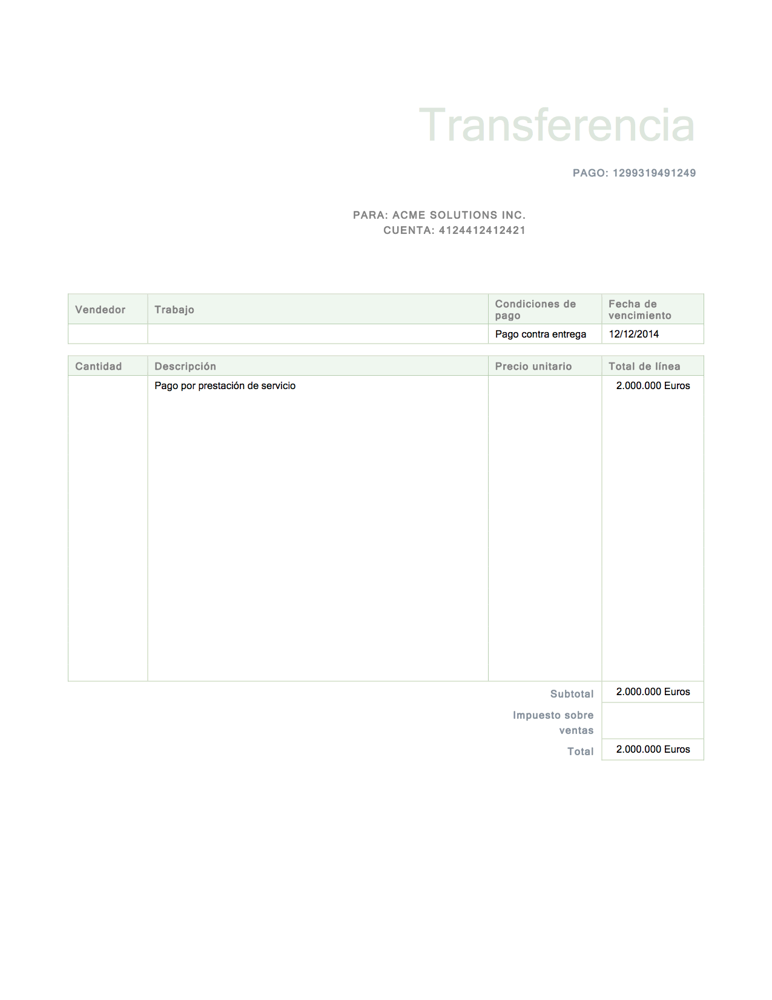

<div class="share-page">
    Share this on &rarr;
    [<a href="https://twitter.com/intent/tweet?text={{ page.title }}&url={{ site.url }}{{ page.url }}&via=e__soriano&related=e__soriano" rel="nofollow" target="_blank" title="Share on Twitter">Twitter</a>]
    [<a href="https://facebook.com/sharer.php?u={{ site.url }}{{ page.url }}" rel="nofollow" target="_blank" title="Share on Facebook">Facebook</a>]
</div>
<br>

___

Muchos programadores siguen pensando que cifrar los datos
es suficiente para mantenerlos _seguros_. En general, el
cifrado **proporciona confidencialidad** pero no asegura
la integridad o autenticidad de los datos.

Es común pensar que cualquier modificación de los
datos cifrados (a partir de ahora, _mensaje o texto cifrado_)
provocará errores
a la hora de descifrar o inconsistencias
en los datos (en su formato o significado/semántica) que
alarmarán a los usuarios (ya sea humanos o programas),
y por tanto se detectarán las manipulaciones.
Nada más lejos de la realidad.

Se dice que un algoritmo de cifrado es **maleable** cuando
se pueden introducir cambios en
el texto cifrado para provocar cambios dirigidos
y peligrosos en el texto descifrado.
Sorpresa: la mayoría de algoritmos de cifrado
convencionales de clave simétrica son maleables.

### Stream ciphers

Los algoritmos de cifrado de stream (_stream ciphers_) son menos conocidos
que los algoritmos de cifrado de bloques (_block ciphers_).

Estos algoritmos se basan en la siguiente idea: generar una secuencia de bytes
(_keystream_) para cifrar un flujo de datos haciendo XOR. El _keystream_
se genera a partir de la clave _K_ y un dato de un único uso _nonce_.
Hace años, se usaba bastante el algoritmo RC4, pero ya no se considera seguro.
Ahora hay otras alternativos como ChaCha20 (RFC 8439), que es tres veces más rápido que AES.

En general, este tipo de algoritmos son totalmente
maleables: cambiando el bit _N_ del
texto cifrado provocaremos un flip en el bit _N_ del texto descifrado. **Esto
es muy peligroso**, ya que el atacante puede cambiar partes del mensaje cifrado
a su antojo sin conocer la clave. Imagina el siguiente caso: si conoces la
estructura de datos que se está cifrando (no el contenido, el formato)
y sabes que en la posición X de un
mensaje hay un entero de interés, es trivial convertirlo a un número negativo
cambiando un único bit **del mensaje cifrado**.

### Block ciphers

Los _block ciphers_, como el famoso AES, también son maleables.

Un _block cipher_ siempre cifra un bloque igual con la misma clave K.
Estos algoritmos se basan en sustituciones y transformaciones de filas y columnas,
que dependen de la clave y los datos de entrada, de tal forma que el cambio en un
único bit de cualquiera de estas dos variables modifica todos los bits de salida.
Deshacer la transformación sin la clave es computacionalmente inviable.
Comúnmente se basa en una red de sustituciones-permutaciones (SPN)
con distintas rondas, con S-boxes (cajas de sustitución) y P-boxes (cajas de
permutación). En cada ronda se usa una clave de ronda, que deriva de la clave
usada.
El estándar actual es AES (algoritmo Rijndael) y se
considera seguro. Hay otros algoritmos de este tipo, como 3DES, CAST5,
Blowfish, etc.

Como un _block cipher_ sólo puede cifrar un bloque, para
cifrar mensajes mayores del tamaño de un bloque (p. ej. 128 bits en el
caso de AES) es necesario
usar estos algoritmos en un _modo de operación_.

El **modo ECB** consiste en partir el texto claro en trozos del tamaño
de bloque y pasar cada trozo por el cifrador, concatenando los trozos
resultantes para formar el texto cifrado. Este modo es **muy inseguro**,
ya que un bloque de texto plano siempre se cifra igual con la misma clave.
Esto deja patrones en el texto cifrado. Este modo **no se debe usar**.

Además, permite sustituir unos bloques
cifrados por otros (siempre que se use la misma clave) y eliminar bloques
del mensaje cifrado.

Veamos un ejemplo. Supongamos que Alice está enviando a Bob transferencias
bancarias representadas por records
cifrados con AES-ECB usando la misma clave K (que sería lo normal).
Pensemos en este record en C (suponiendo que
se preserva el orden de los campos y el tamaño del record es la suma
de los tamaños de los campos, que no siempre ocurre por temas de alineación):

```c
struct Transferencia {
	uint64_t    cuenta_origen;
	uint64_t    cuenta_destino;
	char        concepto[32];
	uint64_t    fecha;
	uint64_t    importe;
};
```

Si Mallory (la atacante) es capaz de capturar esos mensajes,
eliminarlos de la red, modificarlos e inyectarlos, podría
forjar una transacción cifrada falsa a partir de dos transacciones
verdaderas sin conocer la clave de cifrado. Teniendo en cuenta que
los bloques de AES son de 128 bits, es tan fácil como
concatenar los primeros 3 bloques de un mensaje con el cuarto
bloque de otro mensaje.

* Los primer bloque contendría la cuenta origen (64 bits),
la cuenta destino (64 bits) de la primera transacción.

* El segundo y tercer bloque contendría el concepto de la primera
transacción.

* El último bloque tendría la fecha y el importe de la segunda
transacción.  

Bob descifraría la transacción y todo parecería correcto.

Como ya hemos dicho, ECB es muy inseguro y nadie debería estar
usándolo desde hace dos décadas, ¿verdad?
Bueno, mira por ejemplo las siguientes
vulnerabilidades: CVE-2017-2598, CVE-2017-8867...
[hay más](https://www.cvedetails.com/google-search-results.php?q=ECB&sa=Search)

El **modo CBC** ha sido el más popular durante décadas. Actualmente está
siendo reemplazado por otros modos, pero se sigue usando.
En este modo, el cifrado de los bloques del mensaje se van encadenando, de
tal forma que el
cifrado del bloque _N_ no sólo depende de la clave K, sino que
también depende del bloque cifrado
_N-1_, que depende a su vez del anterior, etc.
Antes de cifrar el bloque _N_ de texto claro, se hace un
XOR bit a bit con el bloque _N-1_ de texto cifrado
y después se cifra con la clave K.

Para usar el modo CBC, hay que proporcionar
un _vector de inicialización_ (IV), que
no es otra cosa que el primer valor utilizado para hacer el XOR con el
primer bloque (¡no tiene anterior!).
El IV puede enviarse en claro. Mucha gente piensa lo contrario.
Como bien explica Bruce Scheneier: hay que darse cuenta que para cualquier
bloque que no sea el primero, su  "IV" está disponible para
alguien que tenga acceso al mensaje cifrado (es el bloque cifrado anterior,
que está disponible para el atacante).
Si eso no es un problema para
el bloque cifrado _N_, ¿por qué iba a ser diferente para
el bloque 0?

Bueno, pues el modo CBC también es maleable. Si provocamos un cambio (flip)
en el bit _B_ del bloque _N_ del texto cifrado, se destrozará por completo el
bloque _N_ del texto descifrado y se provocará un cambio en el bit _B_ del
bloque _N+1_ descifrado. Además, en contra de lo que piensa la mayoría
de la gente, el bloque _N+2_ y posteriores del texto descifrado **no sufren
ninguna modificación: el error no se propaga**.
En la [entrada del blog dedicada al ataque de _oracle padding_](oracle.html)
ya se sacaba
partido de esta forma de introducir cambios en el texto descifrado.

<center>
<figure class="image">
  
 </figure>
</center>
<br>

Intuitivamente parece lo contrario, parece que el error se propaga y
destroza todo el texto a partir de la modificación. Me ha costado
convencer a más de un ingeniero veterano de que esto es no así.
Lo mejor es verlo en la práctica:

1. Cojamos una imagen, por ejemplo un fichero TIFF.
2. Ciframos el fichero con AES en modo CBC.
3. Abrimos dicho fichero cifrado
con un editor hexadecimal y cambiamos un 1 por un 0
más o menos en la mitad del fichero.
4. Desciframos el fichero.
5. Abrimos la imagen resultante. Podremos observar que, a simple vista, no
ha sufrido modificaciones. Si nos fijamos mejor, veremos que una parte de la
imagen se ha corrompido, pero a simple vista no es visible.

La siguiente imagen muestra a la izquierda el fichero TIFF original y a
la derecha el fichero TIFF resultante de descifrar después de meter la
modificación de un bit en el texto cifrado:

<center>
<figure class="image">
  
 </figure>
</center>
<br>

Puedes probarlo tú mismo con estos comandos (necesitas tener instalado
el comando _openssl_ y puedes usar cualquier editor hexadecimal, en
el ejemplo uso _bless_):

```
$> openssl aes-256-cbc -nosalt -in clear.tiff -out data.aes -pass pass:pass
$> ## cambia un 1 por un 0 en cualquier byte de la mitad del fichero con un editor hexa
$> bless  data.aes  
$> openssl aes-256-cbc -d -nosalt  -in data.aes -out result.tiff -pass pass:pass
```
Se puede observar que el cambio de un único bit del texto cifrado ha corrompido
únicamente unos cuantos píxeles del fichero TIFF.

La cuestión es que esto es peligroso. Imagina que podemos modificar un mensaje
destruyendo algún dato poco importante (p. ej. el concepto de una transferencia)
pero modificando un entero importante que viene en el siguiente bloque (p. ej.
el importe de la transferencia).

Supongamos el mismo ejemplo anterior de las transacciones (el mismo record):

1. Mallory captura una transacción cifrada con AES-CBC y la elimina de la red.
2. Modifica el bit 127 del tercer bloque del texto cifrado.
3. Envía el mensaje cifrado modificado a Bob.

Cuando Bob descifre el mensaje cifrado:

1. El tercer bloque del mensaje en claro no tendrá ningún sentido.
En el peor de los casos para Mallory, el concepto será una string
sin sentido. Esto se podría detectar (o no): podría provocar un fallo
en la aplicación o causar sospechas a un humano al ver una string
con basura. En el mejor caso para Mallory,
el concepto que llevaba la transacción tenía 7 o menos caracteres.
En ese caso, el terminador de la string de C ('\\0') caería en el
el segundo bloque, por lo que la string del concepto quedaría
intacta (la basura en el tercer bloque no se usa ni se imprime).
2. Se provoca un _flip_ del bit 127 del cuarto bloque
del **texto descifrado**. Suponiendo que estamos en una máquina
_little endian_, esto supone la modificación de uno de los
 bits de más peso de entero sin signo que representa el importe
 de la transacción.

Por tanto, para Bob, la transacción tiene sentido, pero ahora
se trata de una transacción de un importe mucho (*muchísimo*)
más elevado que la original.

Hagamos el experimento. Tenemos este programa _regs.c_ que
lee/escribe un registro de un fichero:

```c
#include <stdio.h>
#include <stdlib.h>
#include <string.h>
#include <err.h>
#include <unistd.h>
#include <sys/types.h>
#include <sys/stat.h>
#include <fcntl.h>
#include <inttypes.h>

/*
	gcc -o regs -Wall regs.c
*/

struct Transfer {
    uint64_t    from;
    uint64_t    to;
    char        details[32];
    uint64_t    date;
    uint64_t    amount;
};
typedef struct Transfer Transfer;

void
usage(void)
{
	fprintf(stderr, "uso: regs [-w] file\n");
	exit(EXIT_FAILURE);
}

void
printtrans(Transfer *t)
{
	printf("FROM: %" PRIu64 "\n", t->from);
	printf("TO: %" PRIu64 "\n", t->to);
	printf("DETAILS: %s\n", t->details);
	printf("DATE: %" PRIu64 "\n", t->date);
	printf("AMOUNT: %" PRIu64 " euros\n", t->amount);
}

void
writetrans(char *path)
{
	int fd;
	Transfer t = {111111,
		222222,
		{'m','o','v','i','e','s','\0'},
		1579769963,
		10};

	fd = open(path, O_WRONLY|O_CREAT|O_TRUNC, 0660);
	if(fd < 0)
		err(EXIT_FAILURE, "open error");
	if(write(fd, &t, sizeof(Transfer)) != sizeof(Transfer))
		err(EXIT_FAILURE, "write error");
	printf("Transfer written:\n");
	printtrans(&t);
	close(fd);
}

void
readtrans(char *path)
{
	int fd;
	Transfer t;

	fd = open(path, O_RDONLY);
	if(fd < 0)
		err(EXIT_FAILURE, "open error");
	if(read(fd, &t, sizeof(Transfer)) != sizeof(Transfer))
		errx(EXIT_FAILURE, "read error or short read");
	printf("Transfer read:\n");
	printtrans(&t);
	close(fd);
}

int
main(int argc, char *argv[])
{
	if(argc == 3 && strcmp(argv[1], "-w") == 0)
		writetrans(argv[2]);
	else if(argc == 2)
	 	readtrans(argv[1]);
	else
		usage();
	exit(EXIT_SUCCESS);
}
```

El programa _flip.c_ introduce un cambio en el bit de la posición
indicada (empezando en 0) de un fichero. Este es su fuente:


```c
#include <stdio.h>
#include <stdlib.h>
#include <err.h>
#include <unistd.h>
#include <sys/types.h>
#include <sys/stat.h>
#include <fcntl.h>

/*
	flip the bit in this position (starting at 0)
	of the file.

	gcc -o flip -Wall flip.c
*/

void
usage(void)
{
	fprintf(stderr, "usage: flip bit-position file\n");
	exit(EXIT_FAILURE);
}

int
main(int argc, char *argv[])
{
	int fd;
	unsigned char c;
	unsigned int byte;
	unsigned int bit;
	int pos;

	if(argc != 3)
		usage();
	pos = atoi(argv[1]);
	if(pos < 0)
		usage();
	fd = open(argv[2], O_RDWR);
	if(fd < 0)
		err(EXIT_FAILURE, "open error");
	byte = pos/8;
	bit = -(pos%8 - 7);
	if(pread(fd, &c, 1, byte) != 1)
		errx(EXIT_FAILURE, "can't read byte");
	c ^= 1<<bit;
	if(pwrite(fd, &c, 1, byte) != 1)
		errx(EXIT_FAILURE, "can't write byte");
	close(fd);
	exit(EXIT_SUCCESS);
}
```

Veamos qué pasa:

```
$> ./regs -w original.reg
Transfer written:
FROM: 111111
TO: 222222
DETAILS: movies
DATE: 1579769963
AMOUNT: 10 euros
$> openssl aes-256-cbc -nosalt -in original.reg -out data.aes -pass pass:somepassword
$> xxd -b -c 8 data.aes
00000000: 11000100 01110010 11101100 11011101 11001011 11100001 01011011 10001010  .r....[.
00000008: 11010110 00101011 01100011 00111010 01111000 00110101 00100101 00110011  .+c:x5%3
00000010: 00101000 10110110 01100111 11011001 10010011 10000011 10101101 11100101  (.g.....
00000018: 11101011 00101001 10100011 10001000 11100101 00000100 11010001 10100000  .)......
00000020: 01011111 01011011 10101110 01001010 00111100 10101000 10111000 11100001  _[.J<...
00000028: 00010011 11100001 11001001 10100010 10011100 00010100 10100011 00001000  ........
00000030: 10110101 00000011 00000110 11000010 00111111 11010110 10011000 11101110  ....?...
00000038: 01101110 00000010 01000110 01110010 00001110 00110100 10001001 11111010  n.Fr.4..
00000040: 00011000 00001101 01011001 11001010 10011000 00011011 01011001 01101100  ..Y...Yl
00000048: 11001101 01110110 10100111 01101100 11110101 01100010 01110000 11101010  .v.l.bp.
$> ./flip $((128*3-1)) data.aes
$> xxd -b -c 8 data.aes
00000000: 11000100 01110010 11101100 11011101 11001011 11100001 01011011 10001010  .r....[.
00000008: 11010110 00101011 01100011 00111010 01111000 00110101 00100101 00110011  .+c:x5%3
00000010: 00101000 10110110 01100111 11011001 10010011 10000011 10101101 11100101  (.g.....
00000018: 11101011 00101001 10100011 10001000 11100101 00000100 11010001 10100000  .)......
00000020: 01011111 01011011 10101110 01001010 00111100 10101000 10111000 11100001  _[.J<...
00000028: 00010011 11100001 11001001 10100010 10011100 00010100 10100011 00001001  ........
00000030: 10110101 00000011 00000110 11000010 00111111 11010110 10011000 11101110  ....?...
00000038: 01101110 00000010 01000110 01110010 00001110 00110100 10001001 11111010  n.Fr.4..
00000040: 00011000 00001101 01011001 11001010 10011000 00011011 01011001 01101100  ..Y...Yl
00000048: 11001101 01110110 10100111 01101100 11110101 01100010 01110000 11101010  .v.l.bp.
$> openssl aes-256-cbc -d -nosalt -in data.aes -out modified.reg -pass pass:somepassword
$> ./regs modified.reg
Transfer read:
FROM: 111111
TO: 222222
DETAILS: movies
DATE: 1579769963
AMOUNT: 72057594037927946 euros
$>
```

El **modo CFB** es  parecido al anterior.
Aquí se cifra el bloque cifrado anterior, y se calcula el XOR entre
el resultado del cifrado y el bloque claro. También es maleable.
En este caso la modificación de un bloque cifrado también provoca un cambio
en ese bloque y en el siguiente descifrados. En el bloque N, el bit modificado
cambia de valor, y el bloque N+1 cambia completamente (justo al revés que
en CBC). Por tanto, el peligro es el mismo.

El **modo CTR**, más usado recientemente, consiste usar un _block cipher_ para
crear un _stream cipher_. Para obtener un _keystream_ se va incrementando un
_nonce_, que se cifra con la clave K. Se cifrará el mensaje haciendo un XOR
con dicho _keystream_. El _nonce_ no se puede reutilizar, claro.
Este modo tiene exactamente el mismo problema que los _stream ciphers_ que hemos
visto antes: la modificación del bit _N_ del mensaje cifrado provoca un
cambio en el bit _N_ del mensaje descifrado.

Veamos otro ejemplo curioso:

1. Alice envía a Bob dos órdenes de pago
que estarán cifradas con AES. Las órdenes son dos imágenes
BMP: [pago1.bmp](figs/pago1.bmp) y [pago2.bmp](figs/pago2.bmp).
2. Mallory intercepta esos dos mensajes cifrados y decide crear una orden de
pago falsa
compuesta por media página de una orden (la del receptor interesado) y media
factura de la otra (la del importe jugoso, originalmente para la empresa ACME):
Hay que tener en cuenta que Mallory **no conoce
la clave de cifrado/descifrado**. Simplemente va a coger la primera parte de
un mensaje cifrado y la segunda parte del otro mensaje cifrado (hasta/desde
una posición que caiga más o menos por la mitad de la imagen) y las va a concatenar.
3. Una vez que Mallory ha fabricado el mensaje cifrado falso, se lo envía a Bob.

Aquí se pueden ver las órdenes de pago, la primera es para la empresa ACME SOLUTIONS
por un importe muy alto y la segunda para el Dr. Soriano
por un importe bajo:

<center>
<figure class="image">
  
 </figure>
</center>
<br>

<center>
<figure class="image">
  
 </figure>
</center>
<br>

##### ¿Qué pasaría con ECB?

```
$> # ciframos los dos pagos
$> openssl  aes-256-ecb  -nosalt -in pago1.bmp -out pago1.ecb -pass pass:pass
$> openssl  aes-256-ecb  -nosalt -in pago2.bmp -out pago2.ecb -pass pass:pass
$> # creamos el pago falso (esto es lo que haría Mallory)
$> cp pago2.ecb fake.ecb
$> dd if=pago1.ecb of=fake.ecb count=197388 bs=16 conv=notrunc
197388+0 records in
197388+0 records out
3158208 bytes (3.2 MB, 3.0 MiB) copied, 0.244689 s, 12.9 MB/s
$> # desciframos el pago falso
$> openssl  aes-256-ecb  -d -nosalt -in fake.ecb -out fake.bmp -pass pass:pass
```

Bob recibiría esta orden de pago:

<center>
<figure class="image">
  
 </figure>
</center>
<br>

Como se puede observar, la imagen falsa es perfecta.

##### ¿Qué pasaría con CBC?

```
$> rm  fake.bmp
$> # ciframos los dos pagos
$> openssl  aes-256-cbc  -nosalt -iv 111 -in pago1.bmp -out pago1.cbc -pass pass:pass
$> openssl  aes-256-cbc  -nosalt -iv 222 -in pago2.bmp -out pago2.cbc -pass pass:pass
$> # creamos el pago falso (esto es lo que haría Mallory)
$> cp pago2.cbc fake.cbc
$> dd if=pago1.cbc of=fake.cbc count=197388 bs=16 conv=notrunc
197388+0 records in
197388+0 records out
3158208 bytes (3.2 MB, 3.0 MiB) copied, 0.240634 s, 13.1 MB/s
$> # desciframos el pago falso
$> openssl  aes-256-cbc  -d -nosalt -iv 111 -in fake.cbc -out fake.bmp -pass pass:pass
```

Bob recibiría esta orden de pago:


<center>
<figure class="image">
  
 </figure>
</center>
<br>

Si miras bien, encontrarás el punto de corte (mira debajo del número
de cuenta). Esa marca posiblemente pasaría desapercibida para un
humano (y si sale por una impresora, más).

##### ¿Qué pasaría con CTR bien usado (i.e. sin repetir _nonce_)?

```
$> rm  fake.bmp
$> # ciframos los dos pagos
$> openssl enc -aes-256-ctr  -nosalt  -iv 111 -in pago1.bmp -out pago1.ctr -pass pass:pass
$> openssl enc -aes-256-ctr  -nosalt  -iv 222 -in pago2.bmp -out pago2.ctr -pass pass:pass
$> # creamos el pago falso (esto es lo que haría Mallory)
$> cp pago2.ctr fake.ctr
$> dd if=pago1.ctr of=fake.ctr count=197388 bs=16 conv=notrunc
197388+0 records in
197388+0 records out
3158208 bytes (3.2 MB, 3.0 MiB) copied, 0.255408 s, 12.4 MB/s
$> # desciframos el pago falso
$> openssl  enc  -d -aes-256-ctr -nosalt  -iv 111 -in fake.ctr -out fake.bmp -pass pass:pass
```

Bob recibiría esta orden de pago:

<center>
<figure class="image">
  
 </figure>
</center>
<br>

En este caso, el ataque corrompe la imagen... pero, ¿qué pasaría
si usamos mal el moco CTR?

##### ¿Qué pasaría con CTR mal usado (i.e. reutilizando _nonce_)?

```
$> rm  fake.bmp
$> # ciframos los dos pagos
$> openssl enc -aes-256-ctr  -nosalt  -iv 111 -in pago1.bmp -out pago1.ctr -pass pass:pass
$> openssl enc -aes-256-ctr  -nosalt  -iv 111 -in pago2.bmp -out pago2.ctr -pass pass:pass
$> # creamos el pago falso (esto es lo que haría Mallory)
$> cp pago2.ctr fake.ctr
$> dd if=pago1.ctr of=fake.ctr count=197388 bs=16 conv=notrunc
197388+0 records in
197388+0 records out
3158208 bytes (3.2 MB, 3.0 MiB) copied, 0.243182 s, 13.0 MB/s
$> # desciframos el pago falso
$> openssl  enc  -d -aes-256-ctr -nosalt  -iv 111 -in fake.ctr -out fake.bmp -pass pass:pass
```

Bob recibiría esta orden de pago:

<center>
<figure class="image">
  
 </figure>
</center>
<br>

Como en el caso de ECB, la imagen es perfecta

## Moraleja

El cifrado nos garantiza la confidencialidad, pero debemos usar alguna
otra herramienta para garantizar la integridad o la autenticidad de los
datos cifrados:

* Cifrar junto con los datos una hash de los mismos. A la hora de descifrar,
comprobar los datos con la hash. Esto nos garantiza integridad y soluciona
el problema, pero la siguiente
opción es mejor, ya que proporciona autenticación al mensaje.

* Usar una MAC para garantizar autenticación a los datos (esto es, que
los datos son genuinos y han sido generados por el emisor), por ejemplo
usando un algoritmo HMAC estándar como HMAC-SHA1. En este caso
siempre hay que usar una clave para cifrar y otra clave para generar la MAC.
Hay tres formas de hacer esto:

	* **Encrypt-and-MAC**, como hace SSH. Consiste en concatenar el
	mensaje cifrado con la MAC de los datos. No es la forma recomendada

	* **MAC-then-Encrypt**, como hace SSL. Consiste en cifrar los datos
	junto con su HMAC. No es la forma recomendada.

	* **Encrypt-then-MAC**, como hace IPSec. Consiste en concatenar
	el mensaje cifrado con la MAC de los datos cifrados. Es  la opción
	más segura y
	se considera un estándar actualmente.

* Usar un modo de cifrado autenticado: existen varios modos que proporcionan
autenticación de los datos, eliminando el problema. Cuando intenta descifrar
con estos modos, el algoritmo sale con fallo si el texto cifrado ha sido
manipulado. Estos modos están reemplazando a los modos tradicionales que
hemos visto. Un modo autenticado muy popular es el **modo GCM** (Galois
Counter Mode).


<sub><sup>
    <b>(cc) Enrique Soriano-Salvador</b>
    Algunos derechos reservados. Este trabajo se entrega bajo la licencia
    Creative Commons Reconocimiento - NoComercial - SinObraDerivada (by-nc-nd).
    Creative Commons, 559 Nathan Abbott Way, Stanford,
    California 94305, USA.
</sup></sub>
