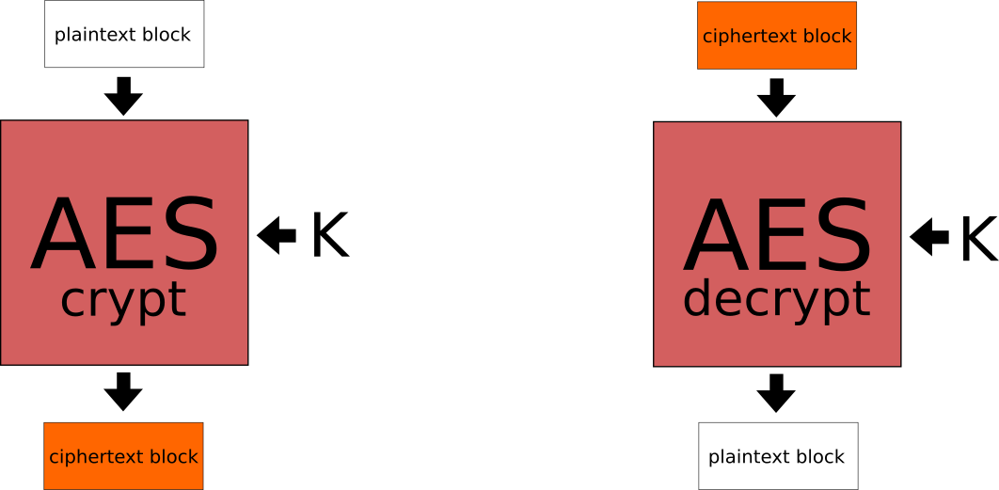
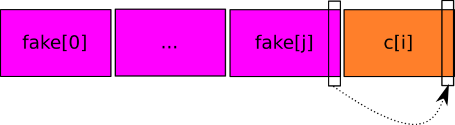

<div class="share-page">
    Share this on &rarr;
    [<a href="https://twitter.com/intent/tweet?text={{ page.title }}&url={{ site.url }}{{ page.url }}&via=e__soriano&related=e__soriano" rel="nofollow" target="_blank" title="Share on Twitter">Twitter</a>]
    [<a href="https://facebook.com/sharer.php?u={{ site.url }}{{ page.url }}" rel="nofollow" target="_blank" title="Share on Facebook">Facebook</a>]
</div>
<br>

Comencemos con una demostración. El siguiente video muestra
cómo un programa ejecutando en mi portátil es capaz de descifrar
un mensaje cifrado con AES-256 en modo CBC y padding PKCS7.

Recordemos que AES es seguro. El tiempo para romper por
fuerza bruta una clave AES-256
en un supercomputador actual es de aproximadamente
**10<sup>52</sup> años**.
Con  1000000000 GPUs de 2 Gigaflops, **60<sup>25</sup> años**.
Además, necesitarías 150 Gigavatios para alimentarlas, esto es,
150 reactores nucleares.

En esta demostración, **tanto el cliente como el servidor son correctos**:
no tienen bugs explotables, usan correctamente las herramientas
criptográficas, etc.

Ahora mira:

<center>
<iframe width="560" height="315" src="https://www.youtube.com/embed/LS_3_6dIIqA" frameborder="0" allowfullscreen></iframe>
</center>
<br>

Ok. El único fallo que tiene el servidor es el siguiente: cuando hay
un error en el mensaje, hace
visible al cliente si se trata de un error en el padding del
mensaje o no. Simplemente eso.

Un ataque de oráculo es un ataque de _side-channel_.
En general, un ataque de oráculo es cuando el protocolo o sistema
tiene un canal lateral que permite deducir si ocurre o no ocurre una
cosa, permitiendo al adversario saber si está cerca o no de conseguir
un objetivo.

En este caso, el _side-channel_ consiste en saber si un mensaje
cifrado que envía el atacante tiene bien formado el padding o no.

Esto lo puede saber si el servidor devuelve un error
que permite diferenciar si hay un error de padding o si el error
es de otro tipo. También se podría saber midiendo el tiempo que
tarda el servidor en responder a una petición, etc.  

El atacante puede sacar partido de esto para
descifrar cualquier mensaje sin tener la clave AES de 256 bits.
Esto se hace explotando un efecto del modo de operación CBC, que
vemos a continuación.

### CBC

AES es un cifrador de bloques, funciona así:

<center>
<figure class="image">
  
  <figcaption>Crifrador de bloques</figcaption>
</figure>
</center>

Cuando queremos usar un cifrador de bloques como AES para cifrar
una mensaje en claro (_M_ a partir de ahora)
más largo que un bloque (128 bits en el caso de AES),
necesitamos usar un **modo de operación**. Hasta hace poco, el modo
de operación estándar era CBC. En la actualidad se recomiendan
otros modos, pero CBC sigue en uso y no se considera inseguro (siempre
que se tomen precauciones).

Para cifrar un mensaje largo, se parte en
trozos del tamaño de bloque del algoritmo (128 bits en AES/Rijndael).
Cada trozo se cifra con AES usando la clave indicada. El modo de
operación establece cómo se cifran los distintos trozos.

Si se cifran todos los bloques tal cual
(modo llamado ECB), los bloques del mensaje cifrado
(_C_ a partir de ahora)
pueden terminar con patrones derivados del mensaje en claro. Piensa en
esto: si estás cifrando un pixmap y tienes la mala suerte de que cada
pixel ocupa un bloque completo, el pixmap cifrado será otro pixmap en el
que unos colores se han reemplazado por otros. Seguramente puedas reconocer
la imagen cifrada.

El modo CBC se pensó para evitar ese efecto y ocultar patrones del mensaje
en claro. Este modo consiste en hacer una operación XOR bit a bit entre
el bloque N del mensaje en claro y el bloque N-1 del mensaje cifrado,
antes de pasarlo por el cifrador AES.
De esta forma, se están _encadenando_
los bloques. Al resultado de ese XOR (esto es,
el bloque antes de pasar por el cifrador) se le llama **estado intermedio**.
Esto es importante, aparecerá más tarde.

Por tanto, en CBC un bloque _i_ se cifra así (siendo K la clave):

<center>
C[i] = AES<sub>K</sub>(M[i] ⊕ C[i-1])
</center>
<br>

<center>
<figure class="image">
  
  <figcaption>Descifrado en el modo CBC.</figcaption>
</figure>
</center>
<br>

Para el primer bloque del mensaje, que no tiene
anterior, se usa el _vector de inicialización_, que se debe proporcionar
junto con la clave a la hora de cifrar/descifrar el mensaje con AES en
modo CBC (y debe ser aleatorio, no predecible y no se debe reusar).

Un problema importante del modo CBC es que es **maleable**. Esto significa que
el atacante puede modificar el mensaje cifrado para provocar cambios en
el mensaje descifrado.

En CBC, el cambio del bit _i_ del bloque _N_ del mensaje cifrado supone
dos cambios en el mensaje descifrado:

1. El bloque _N_ del mensaje descifrado cambiará completamente (no tendrá
	ningún sentido).
2. Se provoca un _flip_ del bit _i_ del bloque _N+1_ del mensaje descifrado:
ese bit habrá cambiado (será 0 si antes era 1, y viceversa).

Mucha gente piensa que una modificación en un mensaje cifrado en modo
CBC destroza el mensaje descifrado desde el bloque modificado hasta
el final del mensaje. **No es así**. El bloque _N+2_, y los siguientes,
no se ven afectados por esa modificación del mensaje cifrado.

<center>
<figure class="image">
  
  <figcaption>Modificación de un bit del texto cifrado en modo CBC.</figcaption>
</figure>
</center>
<br>

### Padding

Cuando tenemos un mensaje que no es múltiplo del tamaño del bloque,
el último bloque del mensaje se tiene que _rellenar_, ya que al
cifrador hay que darle bloques completos.

<center>
<figure class="image">
  
 </figure>
</center>
<br>

Hay varias formas
de hacer esto. Para este ejemplo estamos usando el estándar de
padding PKCS7, que consiste en rellenar con todos los bytes puestos al
número de bytes del padding:

 ```
      01
      02 02
      03 03 03
      04 04 04 04
      05 05 05 05 05
      etc.
```

Por ejemplo, si en el último bloque tienes que rellenar con 7 bytes,
se pondrían los siete con un valor _0x07_.
Si el mensaje es múltiplo del tamaño
de bloque, se debe meter un bloque completo de padding.

### Ataque

Para realizar el ataque, el adversario necesita:

1. Capturar el tráfico cifrado legítimo de un cliente.

2. Poder enviar peticiones espurias al servidor.

3. Diferenciar los fallos provocados por un padding incorrecto del
	resto de fallos. Esta es la fuga de información necesaria
	para realizar este ataque de side-channel.


#### Ataque I: conocer el tamaño del mensaje cifrado

El primer ataque, más sencillo, consiste en descubrir el tamaño
del mensaje cifrado (esto es, saber cuánto padding se ha usado).
Esto es algo que un atacante no debería poder descubrir.

Para ello:

1. Se envían versiones modificadas del mensaje cifrado original, _C_.

2. Por cada intento, se modifica un único byte del *penúltimo*
	bloque de _C_.

3. Se empieza modificando el último byte de ese bloque,
	y se va iterando hacia atrás.

4. Paramos cuando el servidor *no* de un error de padding (dará
	otro tipo de error).

5. Si eso pasa en N-ésimo byte del penúltimo bloque, ya sabemos que el 	
	mensaje original tiene una longitud en bytes de (siendo _NBLOCKS_
	el número total de bloques del mensaje cifrado _C_):

<center>
	LEN(M) = BLOCKSIZE * (NBLOCKS - 1) + N
</center>
<br>

#### Ataque II: descifrar un mensaje interceptado previamente

Ahora el objetivo es **descifrar un mensaje de un cliente legítimo**
capturado previamente, que mucho más interesante.

Llamemos _C[i]_ al bloque del mensaje cifrado _C_ que queremos
descifrar. La idea principal es esta:

1. Usaremos _C[i]_ como *último* bloque de un mensaje espurio
que llamaremos _fake_. Esto es, se usará como el bloque en el
que tendría que estar el padding.

2. Modificaremos repetidamente el penúltimo bloque del mensaje
	espurio, _fake[j]_, para descubrir
	cuándo el servidor *no* retorna un error de padding.
	Cuando no retorne error de padding, paramos.

3. Ya tenemos el **valor intermedio** de cada byte de _C[i]_.

4. Con el valor intermedio, reconstruiremos cada byte del correspondiente
	bloque del mensaje en claro original, _M[i]_.

5. Esto lo haremos por cada bloque de _C_ hasta conseguir el
	mensaje en claro original completo, _M_.

Veamos cómo descifrar un único byte del último bloque del
mensaje en claro (el bloque de la posición _last_).

Así encontramos el valor _val_ que hace que el último
byte al descifrar _C[i]_ sea _0x01_, **que hace que
sea un padding PKCS7 correcto de 1 byte** (y en ese caso el servidor
devolverá un error distinto a padding incorrecto):

```
val := 0
found := false
while val <=  255 and not found
    fake[j][last] := val
    sendFakeMessage()
    if not paddingError then
         found := true
    else
         val := val + 1
    end if
end while
```
<center>
<figure class="image">
  
 </figure>
</center>
<br>

Obtenemos el valor intermedio correspondiente a dicho byte:

<center>
 I := val ⊕ 0x01
</center>
<br>

Después obtenemos el valor del byte en el texto claro, _M[i][last]_,
**usando el bloque cifrado anterior del mensaje original**,
_C[i-1][last]_:

<center>
 M[i][last] := C[i-1][last] ⊕ I
</center>
<br>


Después, para descifrar el penúltimo byte, _C[i][last-1]_:

1. Hacemos lo mismo, pero teniendo en cuenta que el
		padding correcto ahora debe ser _0x02,0x02_.

2. No hay problema, dado que ya sabemos el valor
		de _M[i][last]_.

3. Podemos calcular el valor
	de _fake[j][last]_ para que al descifrar el último byte del
	mensaje espurio descifrado sea _0x02_.

**Y así con el resto de bytes del bloque _i_.**

Para descifrar el primer bloque _C[0]_, debemos
usar el vector de inicialización.

**La esperanza es descifrar el mensaje entero en _128 * len(M)_
peticiones al servidor.**

### Implementación del ejemplo

Puedes encontrar el código de la demostración implementado en Go
en este gitlab:

[https://gitlab.etsit.urjc.es/esoriano/padding-oracle](https://gitlab.etsit.urjc.es/esoriano/padding-oracle)

Puedes bajarlo así:

```
$> go get -d -v gitlab.etsit.urjc.es/esoriano/padding-oracle.git
```

Y para ejecutarlo:

```
$> cd $GOPATH/src/gitlab.etsit.urjc.es/esoriano/padding-oracle.git
$> go run server.go &
$> go run client.go
$> go run attack.go
```

### Contramedidas

Para evitar este tipo de ataques, podemos implementar ciertas
contramedidas:

1. Usar un modo de operación no maleable o un modo de operación
	autenticado (p. ej. GCM).

2. No dar detalles a los clientes sobre los errores internos del servidor
	que tienen que ver con la seguridad.

3. Intentar responder en un tiempo constante, independientemente del error
	que se produzca (evitar timing side-channels). Existen bibliotecas
	con operaciones con tiempo constante para diferentes operaciones
	(p. ej. [subtle](https://golang.org/pkg/crypto/subtle/) en Golang).

4. Limitar el número de peticiones inválidas
		de los clientes (espera exponencial, listas negras
		de clientes,
		etc.).


### Historia

Este ataque fue publicado en 2002 por Serge Vaudenay [1],
y se encontraron vulnerabilidades en JavaServer Faces, Ruby on Rails,
ASP.NET, Steam y otros.

En 2013, se descubrió que OpenSSL y GnuTLS eran
vulnerables a una variante llamada
Lucky Thirteen [2]. OpenSSL no fue parcheado hasta 2016.

En 2014, se descubrió que TLS era
vulnerable a una variante llamada
POODLE (Padding Oracle On Downgraded Legacy Encryption) [3].


**_"Attacks only get better, they never get worse"_, Bruce Schneier.**

**_"Attack names do get worse"_, Matthew Green.**


### Referencias

[1]  Serge Vaudenay. Security Flaws Induced by CBC Padding Applications
to SSL, IPSEC, WTLS. EUROCRYPT 2002.

[2]  Nadhem J. AlFardan and Kenneth G. Paterson.
"Lucky Thirteen: Breaking the TLS and DTLS Record Protocols".
Royal Holloway, University of London. Retrieved 21 June 2013.

[3]  Matthew Green. "Attack of the week: POODLE".
[Link](https://www.poodle.io).


<sub><sup>
    <b>(cc) Enrique Soriano-Salvador</b>
    Algunos derechos reservados. Este trabajo se entrega bajo la licencia
    Creative Commons Reconocimiento - NoComercial - SinObraDerivada (by-nc-nd).
    Creative Commons, 559 Nathan Abbott Way, Stanford,
    California 94305, USA.
</sup></sub>
