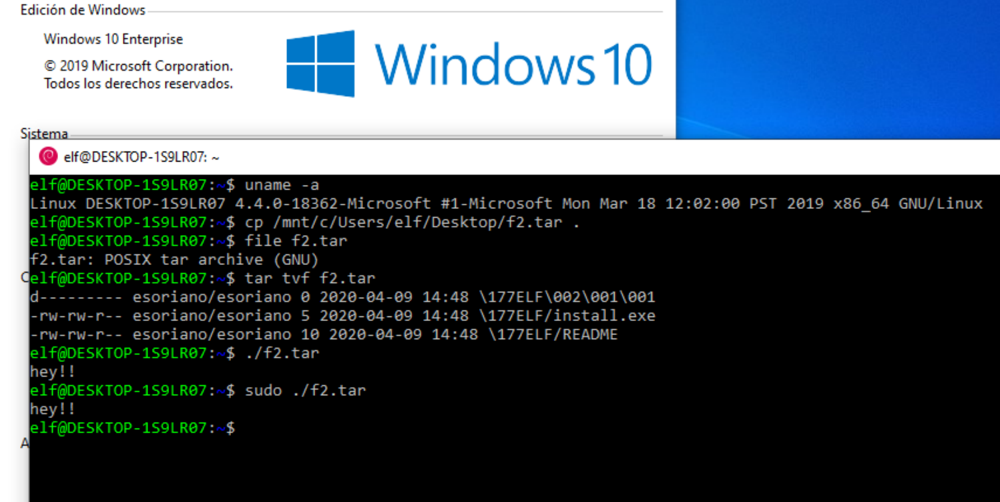

<div class="share-page">
    Share this on &rarr;
    [<a title="Share on Mastodon" href="https://tootpick.org/#text=Check%20out%20https://sysfatal.github.io{{  page.url }}%20by%20@esoriano@social.linux.pizza">Mastodon</a>]
    [<a href="https://twitter.com/intent/tweet?text={{ page.title }}&url={{ site.url }}{{ page.url }}&via=e__soriano&related=e__soriano" rel="nofollow" target="_blank" title="Share on Twitter">Twitter</a>]
    [<a href="https://facebook.com/sharer.php?u={{ site.url }}{{ page.url }}" rel="nofollow" target="_blank" title="Share on Facebook">Facebook</a>]
</div>
<br>

___

<center>
<figure class="image">
  
</figure>
</center>


Polyglots are files that can play the role of two or more file formats
simultaneously. They are used to bypass protection mechanisms (e.g. IDS or AV).
There are a lot of different polyglot types, you can find a good
compilation of references  [here](https://github.com/mindcrypt/polyglot).

Most polyglots break the metadata structure of one of their _types_ because
most file formats put the *magic number*  (or *file signature*)
at offset 0, so you have to pick only one magic number for the file.

Nevertheless, there are
some weird file types that don't put the *magic number* at offset 0. One
of them is very popular for UNIX geeks (like me): TAR. It's an old file
archiver used in UNIX (a .tgz file is a compressed tar).

This post describes a TAR+ELF polyglot PoC: **polyglottar**. This file
is identified and can be used as a TAR, but it's also an ELF binary that
can be executed on a Linux system.

I am not the first one focusing on the TAR format to make a polyglot.
For example, _PoC or GTFO_ [#6](https://www.alchemistowl.org/pocorgtfo/) describes a TAR + PDF polyglot

In addition, a paper titled
[Abusing File Processing in Malware Detectors for Fun and Profit](https://ieeexplore.ieee.org/document/6234406),
(2012 IEEE Symposium on Security and Privacy) also describes TAR as a technique
to hide exploits. CVE 2012-1429 references this paper.

In this [polyglot database](https://github.com/Polydet/polyglot-database), there is not a TAR+ELF polygot...

So let's do it!

### TAR

The format is described in [this manual](https://www.gnu.org/software/tar/manual/html_node/Standard.html).
The TAR *magic number* is placed at *offset* ```0x101```.
We focus on the POSIX TAR format.
This is the file header (as a C struct):

```c
struct posix_header
{                           
  char name[100];              
  char mode[8];                
  char uid[8];                  
  char gid[8];                 
  char size[12];                
  char mtime[12];               
  char chksum[8];               
  char typeflag;                
  char linkname[100];           
  char magic[6];                
  char version[2];              
  char uname[32];             
  char gname[32];             
  char devmajor[8];             
  char devminor[8];            
  char prefix[155];            
};
```

The first field is the name of the directory.
What if the directory has a funny name, for example, the *magic number* of another
file format?

Let's try it. We will use the ELF execuable format magic number:  ```0x7f454c46```,
that is, the byte ```0x7f``` followed by the string  ```ELF```).

```
$> mkdir test
$> cp file1 file2 file3 test
$> mv test  $'\x7FELF'
$> ls -d *ELF*
''$'\177''ELF'
$> tar cvf file.tar  $'\x7FELF'
$> file file.tar
file.tar: POSIX tar archive (GNU)
$> xxd file.tar | head -1
00000000: 7f45 4c46 2f00 0000 0000 0000 0000 0000  .ELF/..........
$>
```

This way, we can put both magic numbers (TAR and ELF) in the same
file. Note that the file is recognized as a TAR file by the ```file``` command.

### ELF

This is the 64-bit ELF header:


```c
typedef struct
{
  unsigned char e_ident[EI_NIDENT];     /* Magic number and other info */
  Elf64_Half    e_type;                 /* Object file type */
  Elf64_Half    e_machine;              /* Architecture */
  Elf64_Word    e_version;              /* Object file version */
  Elf64_Addr    e_entry;                /* Entry point virtual address */
  Elf64_Off     e_phoff;                /* Program header table file offset */
  Elf64_Off     e_shoff;                /* Section header table file offset */
  Elf64_Word    e_flags;                /* Processor-specific flags */
  Elf64_Half    e_ehsize;               /* ELF header size in bytes */
  Elf64_Half    e_phentsize;            /* Program header table entry size */
  Elf64_Half    e_phnum;                /* Program header table entry count */
  Elf64_Half    e_shentsize;            /* Section header table entry size */
  Elf64_Half    e_shnum;                /* Section header table entry count */
  Elf64_Half    e_shstrndx;             /* Section header string table index */
} Elf64_Ehdr;
```
***

After the header, there are the sections (data for the linker)
and segments (data to load the program:
TEXT (instructions), DATA (global variables), and so on).

### POLYGLOTTAR

We will use this little program (we will use _GNU AS_, so it's _AT&T assembly syntax_)
for the PoC (example code taken from [here](https://medium.com/@dmxinajeansuit/elf-binary-mangling-part-1-concepts-e00cb1352301)):

```
.global _start
.text
_start:
    mov   $1, %al     # RAX holds syscall 1 (write), I chose to use
                      # %al, which is the lower 8 bits of the %rax
                      # register. From a binary standpoint, there
                      # is less space used to represent this than
                      # mov $1, %rax
    mov   %rax, %rdi  # RDI holds File Handle 1, STDOUT. This means
                      # that we are writing to the screen. Again,
                      # moving RAX to RDI is shorter than
                      # using mov $1, %rdi
    mov   $msg, %rsi  # RSI holds the address of our string buffer.
    mov   $6, %dl     # RDX holds the size our of string buffer.
                      # Moving into %dl to save space.
    syscall           # Invoke a syscall with these arguments.
    mov   $60, %al    # Now we are invoking syscall 60.
    xor   %rdi, %rdi  # Zero out RDI, which holds the return value.
    syscall           # Call the system again to exit.
msg:
    .ascii "hey!!\n"
```

The program just writes ```hey!!``` in its standard output.
First, it performs a  ```write```
system call. Then it finishes with ```exit``` the system call.
Let's see:

```
$> as hey.s -o hey.o
$> ld hey.o -o hey
$> ./hey
hey!!
$>
```

Let's dump the ELF file generated by ```ld```:

```
$> readelf -a hey
ELF Header:
  Magic:   7f 45 4c 46 02 01 01 00 00 00 00 00 00 00 00 00
  Class:                             ELF64
  Data:                              2's complement, little endian
  Version:                           1 (current)
  OS/ABI:                            UNIX - System V
  ABI Version:                       0
  Type:                              EXEC (Executable file)
  Machine:                           Advanced Micro Devices X86-64
  Version:                           0x1
  Entry point address:               0x0
  Start of program headers:          64 (bytes into file)
  Start of section headers:          2097360 (bytes into file)
  Flags:                             0x0
  Size of this header:               64 (bytes)
  Size of program headers:           56 (bytes)
  Number of program headers:         1
  Size of section headers:           64 (bytes)
  Number of section headers:         5
  Section header string table index: 4

Section Headers:
  [Nr] Name              Type             Address           Offset
       Size              EntSize          Flags  Link  Info  Align
  [ 0]                   NULL             0000000000000000  00000000
       0000000000000000  0000000000000000           0     0     0
  [ 1] .text             PROGBITS         0000000000000000  00200000
       000000000000001d  0000000000000000  AX       0     0     1
  [ 2] .symtab           SYMTAB           0000000000000000  00200020
       0000000000000078  0000000000000018           3     4     8
  [ 3] .strtab           STRTAB           0000000000000000  00200098
       0000000000000016  0000000000000000           0     0     1
  [ 4] .shstrtab         STRTAB           0000000000000000  002000ae
       0000000000000021  0000000000000000           0     0     1
Key to Flags:
  W (write), A (alloc), X (execute), M (merge), S (strings), I (info),
  L (link order), O (extra OS processing required), G (group), T (TLS),
  C (compressed), x (unknown), o (OS specific), E (exclude),
  l (large), p (processor specific)

There are no section groups in this file.

Program Headers:
  Type           Offset             VirtAddr           PhysAddr
                 FileSiz            MemSiz              Flags  Align
  LOAD           0x0000000000200000 0x0000000000000000 0x0000000000000000
                 0x000000000000001d 0x000000000000001d  R E    0x200000

 Section to Segment mapping:
  Segment Sections...
   00     .text

There is no dynamic section in this file.

There are no relocations in this file.

The decoding of unwind sections for machine type Advanced Micro Devices X86-64 is not currently supported.

Symbol table '.symtab' contains 5 entries:
   Num:    Value          Size Type    Bind   Vis      Ndx Name
     0: 0000000000000000     0 NOTYPE  LOCAL  DEFAULT  UND
     1: 0000000000000000     0 SECTION LOCAL  DEFAULT    1
     2: 0000000000000000     0 FILE    LOCAL  DEFAULT  ABS asm_hey.o
     3: 0000000000000017     0 NOTYPE  LOCAL  DEFAULT    1 msg
     4: 0000000000000000     0 NOTYPE  GLOBAL DEFAULT    1 _start

No version information found in this file.
$>
```

Basically, it has the TEXT segment, the symbol table and the string table.

We have a problem: the TAR header is 512 bytes (in fact, the header
is 500 bytes, but TAR works with 512 byte sectors).
If we want a valid TAR, we also need to preserve the TAR data, but it will
destroy the TEXT segment of the ELF. What can we do?

#### Plan

This is my plan:

- Create a new segment in the ELF, named CUSTOM. This segment will
contain part of the TAR header and the TAR data.

- Ignore the CUSTOM segment in the program.

<center>
<figure class="image">
  
</figure>
</center>

Let's change the program in order to create the new segment:

```
$> cat proto1.s
.global _start
.text
_start:
    mov   $1, %al     # RAX holds syscall 1 (write), I chose to use
                      # %al, which is the lower 8 bits of the %rax
                      # register. From a binary standpoint, there
                      # is less space used to represent this than
                      # mov $1, %rax
    mov   %rax, %rdi  # RDI holds File Handle 1, STDOUT. This means
                      # that we are writing to the screen. Again,
                      # moving RAX to RDI is shorter than
                      # using mov $1, %rdi
    mov   $msg, %rsi  # RSI holds the address of our string buffer.
    mov   $6, %dl     # RDX holds the size our of string buffer.
                      # Moving into %dl to save space.
    syscall           # Invoke a syscall with these arguments.
    mov   $60, %al    # Now we are invoking syscall 60.
    xor   %rdi, %rdi  # Zero out RDI, which holds the return value.
    syscall           # Call the system again to exit.
msg:
    .ascii "hey!!\n"

.section .custom , "aw" , @progbits
    .ascii "This lives in the CUSTOM section"
$>
```

Let's dump the ELF:

```
$> readelf -a proto1
ELF Header:
  Magic:   7f 45 4c 46 02 01 01 00 00 00 00 00 00 00 00 00
  Class:                             ELF64
  Data:                              2's complement, little endian
  Version:                           1 (current)
  OS/ABI:                            UNIX - System V
  ABI Version:                       0
  Type:                              EXEC (Executable file)
  Machine:                           Advanced Micro Devices X86-64
  Version:                           0x1
  Entry point address:               0x4000b0
  Start of program headers:          64 (bytes into file)
  Start of section headers:          536 (bytes into file)
  Flags:                             0x0
  Size of this header:               64 (bytes)
  Size of program headers:           56 (bytes)
  Number of program headers:         2
  Size of section headers:           64 (bytes)
  Number of section headers:         6
  Section header string table index: 5

Section Headers:
  [Nr] Name              Type             Address           Offset
       Size              EntSize          Flags  Link  Info  Align
  [ 0]                   NULL             0000000000000000  00000000
       0000000000000000  0000000000000000           0     0     0
  [ 1] .text             PROGBITS         00000000004000b0  000000b0
       000000000000001d  0000000000000000  AX       0     0     1
  [ 2] .custom           PROGBITS         00000000006000cd  000000cd
       0000000000000020  0000000000000000  WA       0     0     1
  [ 3] .symtab           SYMTAB           0000000000000000  000000f0
       00000000000000d8  0000000000000018           4     5     8
  [ 4] .strtab           STRTAB           0000000000000000  000001c8
       0000000000000026  0000000000000000           0     0     1
  [ 5] .shstrtab         STRTAB           0000000000000000  000001ee
       0000000000000029  0000000000000000           0     0     1
Key to Flags:
  W (write), A (alloc), X (execute), M (merge), S (strings), I (info),
  L (link order), O (extra OS processing required), G (group), T (TLS),
  C (compressed), x (unknown), o (OS specific), E (exclude),
  l (large), p (processor specific)

There are no section groups in this file.

Program Headers:
  Type           Offset             VirtAddr           PhysAddr
                 FileSiz            MemSiz              Flags  Align
  LOAD           0x0000000000000000 0x0000000000400000 0x0000000000400000
                 0x00000000000000cd 0x00000000000000cd  R E    0x200000
  LOAD           0x00000000000000cd 0x00000000006000cd 0x00000000006000cd
                 0x0000000000000020 0x0000000000000020  RW     0x200000

 Section to Segment mapping:
  Segment Sections...
   00     .text
   01     .custom

There is no dynamic section in this file.

There are no relocations in this file.

The decoding of unwind sections for machine type Advanced Micro Devices X86-64 is not currently supported.

Symbol table '.symtab' contains 9 entries:
   Num:    Value          Size Type    Bind   Vis      Ndx Name
     0: 0000000000000000     0 NOTYPE  LOCAL  DEFAULT  UND
     1: 00000000004000b0     0 SECTION LOCAL  DEFAULT    1
     2: 00000000006000cd     0 SECTION LOCAL  DEFAULT    2
     3: 0000000000000000     0 FILE    LOCAL  DEFAULT  ABS proto1.o
     4: 00000000004000c7     0 NOTYPE  LOCAL  DEFAULT    1 msg
     5: 00000000004000b0     0 NOTYPE  GLOBAL DEFAULT    1 _start
     6: 00000000006000ed     0 NOTYPE  GLOBAL DEFAULT    2 __bss_start
     7: 00000000006000ed     0 NOTYPE  GLOBAL DEFAULT    2 _edata
     8: 00000000006000f0     0 NOTYPE  GLOBAL DEFAULT    2 _end

No version information found in this file.
$>
```

We have a problem. We need to put the CUSTOM segment before the TEXT segment,
it has to be the first segment of the ELF. How can we do that? We need some
```ld``` hacking.

The  option  ```--verbose``` provides the _ld script_ that is used to link the program:

```
$> ld --verbose proto1.o -o proto1
GNU ld (GNU Binutils for Ubuntu) 2.30
  Supported emulations:
   elf_x86_64
   elf32_x86_64
   elf_i386
   elf_iamcu
   i386linux
   elf_l1om
   elf_k1om
   i386pep
   i386pe
using internal linker script:
==================================================
/* Script for -z combreloc: combine and sort reloc sections */
/* Copyright (C) 2014-2018 Free Software Foundation, Inc.
   Copying and distribution of this script, with or without modification,
   are permitted in any medium without royalty provided the copyright
   notice and this notice are preserved.  */
OUTPUT_FORMAT("elf64-x86-64", "elf64-x86-64",
	      "elf64-x86-64")
OUTPUT_ARCH(i386:x86-64)
ENTRY(_start)
SEARCH_DIR("=/usr/local/lib/x86_64-linux-gnu"); SEARCH_DIR("=/lib/x86_64-linux-gnu"); SEARCH_DIR("=/usr/lib/x86_64-linux-gnu"); SEARCH_DIR("=/usr/lib/x86_64-linux-gnu64"); SEARCH_DIR("=/usr/local/lib64"); SEARCH_DIR("=/lib64"); SEARCH_DIR("=/usr/lib64"); SEARCH_DIR("=/usr/local/lib"); SEARCH_DIR("=/lib"); SEARCH_DIR("=/usr/lib"); SEARCH_DIR("=/usr/x86_64-linux-gnu/lib64"); SEARCH_DIR("=/usr/x86_64-linux-gnu/lib");
SECTIONS
{
  /* Read-only sections, merged into text segment: */
  PROVIDE (__executable_start = SEGMENT_START("text-segment", 0x400000)); . = SEGMENT_START("text-segment", 0x400000) + SIZEOF_HEADERS;
  .interp         : { *(.interp) }
  .note.gnu.build-id : { *(.note.gnu.build-id) }
  .hash           : { *(.hash) }
  .gnu.hash       : { *(.gnu.hash) }
  .dynsym         : { *(.dynsym) }
  .dynstr         : { *(.dynstr) }
  .gnu.version    : { *(.gnu.version) }
  .gnu.version_d  : { *(.gnu.version_d) }
  .gnu.version_r  : { *(.gnu.version_r) }
  .rela.dyn       :
    {
      *(.rela.init)
      *(.rela.text .rela.text.* .rela.gnu.linkonce.t.*)
      *(.rela.fini)
      *(.rela.rodata .rela.rodata.* .rela.gnu.linkonce.r.*)
      *(.rela.data .rela.data.* .rela.gnu.linkonce.d.*)
      *(.rela.tdata .rela.tdata.* .rela.gnu.linkonce.td.*)
      *(.rela.tbss .rela.tbss.* .rela.gnu.linkonce.tb.*)
      *(.rela.ctors)
      *(.rela.dtors)
      *(.rela.got)
      *(.rela.bss .rela.bss.* .rela.gnu.linkonce.b.*)
      *(.rela.ldata .rela.ldata.* .rela.gnu.linkonce.l.*)
      *(.rela.lbss .rela.lbss.* .rela.gnu.linkonce.lb.*)
      *(.rela.lrodata .rela.lrodata.* .rela.gnu.linkonce.lr.*)
      *(.rela.ifunc)
    }
  .rela.plt       :
    {
      *(.rela.plt)
      PROVIDE_HIDDEN (__rela_iplt_start = .);
      *(.rela.iplt)
      PROVIDE_HIDDEN (__rela_iplt_end = .);
    }
  .init           :
  {
    KEEP (*(SORT_NONE(.init)))
  }
  .plt            : { *(.plt) *(.iplt) }
.plt.got        : { *(.plt.got) }
.plt.sec        : { *(.plt.sec) }
  .text           :
  {
    *(.text.unlikely .text.*_unlikely .text.unlikely.*)
    *(.text.exit .text.exit.*)
    *(.text.startup .text.startup.*)
    *(.text.hot .text.hot.*)
    *(.text .stub .text.* .gnu.linkonce.t.*)
    /* .gnu.warning sections are handled specially by elf32.em.  */
    *(.gnu.warning)
  }
  .fini           :
  {
    KEEP (*(SORT_NONE(.fini)))
  }
  PROVIDE (__etext = .);
  PROVIDE (_etext = .);
  PROVIDE (etext = .);
  .rodata         : { *(.rodata .rodata.* .gnu.linkonce.r.*) }
  .rodata1        : { *(.rodata1) }
  .eh_frame_hdr : { *(.eh_frame_hdr) *(.eh_frame_entry .eh_frame_entry.*) }
  .eh_frame       : ONLY_IF_RO { KEEP (*(.eh_frame)) *(.eh_frame.*) }
  .gcc_except_table   : ONLY_IF_RO { *(.gcc_except_table
  .gcc_except_table.*) }
  .gnu_extab   : ONLY_IF_RO { *(.gnu_extab*) }
  /* These sections are generated by the Sun/Oracle C++ compiler.  */
  .exception_ranges   : ONLY_IF_RO { *(.exception_ranges
  .exception_ranges*) }
  /* Adjust the address for the data segment.  We want to adjust up to
     the same address within the page on the next page up.  */
  . = DATA_SEGMENT_ALIGN (CONSTANT (MAXPAGESIZE), CONSTANT (COMMONPAGESIZE));
  /* Exception handling  */
  .eh_frame       : ONLY_IF_RW { KEEP (*(.eh_frame)) *(.eh_frame.*) }
  .gnu_extab      : ONLY_IF_RW { *(.gnu_extab) }
  .gcc_except_table   : ONLY_IF_RW { *(.gcc_except_table .gcc_except_table.*) }
  .exception_ranges   : ONLY_IF_RW { *(.exception_ranges .exception_ranges*) }
  /* Thread Local Storage sections  */
  .tdata	  : { *(.tdata .tdata.* .gnu.linkonce.td.*) }
  .tbss		  : { *(.tbss .tbss.* .gnu.linkonce.tb.*) *(.tcommon) }
  .preinit_array     :
  {
    PROVIDE_HIDDEN (__preinit_array_start = .);
    KEEP (*(.preinit_array))
    PROVIDE_HIDDEN (__preinit_array_end = .);
  }
  .init_array     :
  {
    PROVIDE_HIDDEN (__init_array_start = .);
    KEEP (*(SORT_BY_INIT_PRIORITY(.init_array.*) SORT_BY_INIT_PRIORITY(.ctors.*)))
    KEEP (*(.init_array EXCLUDE_FILE (*crtbegin.o *crtbegin?.o *crtend.o *crtend?.o ) .ctors))
    PROVIDE_HIDDEN (__init_array_end = .);
  }
  .fini_array     :
  {
    PROVIDE_HIDDEN (__fini_array_start = .);
    KEEP (*(SORT_BY_INIT_PRIORITY(.fini_array.*) SORT_BY_INIT_PRIORITY(.dtors.*)))
    KEEP (*(.fini_array EXCLUDE_FILE (*crtbegin.o *crtbegin?.o *crtend.o *crtend?.o ) .dtors))
    PROVIDE_HIDDEN (__fini_array_end = .);
  }
  .ctors          :
  {
    /* gcc uses crtbegin.o to find the start of
       the constructors, so we make sure it is
       first.  Because this is a wildcard, it
       doesn't matter if the user does not
       actually link against crtbegin.o; the
       linker won't look for a file to match a
       wildcard.  The wildcard also means that it
       doesn't matter which directory crtbegin.o
       is in.  */
    KEEP (*crtbegin.o(.ctors))
    KEEP (*crtbegin?.o(.ctors))
    /* We don't want to include the .ctor section from
       the crtend.o file until after the sorted ctors.
       The .ctor section from the crtend file contains the
       end of ctors marker and it must be last */
    KEEP (*(EXCLUDE_FILE (*crtend.o *crtend?.o ) .ctors))
    KEEP (*(SORT(.ctors.*)))
    KEEP (*(.ctors))
  }
  .dtors          :
  {
    KEEP (*crtbegin.o(.dtors))
    KEEP (*crtbegin?.o(.dtors))
    KEEP (*(EXCLUDE_FILE (*crtend.o *crtend?.o ) .dtors))
    KEEP (*(SORT(.dtors.*)))
    KEEP (*(.dtors))
  }
  .jcr            : { KEEP (*(.jcr)) }
  .data.rel.ro : { *(.data.rel.ro.local* .gnu.linkonce.d.rel.ro.local.*) *(.data.rel.ro .data.rel.ro.* .gnu.linkonce.d.rel.ro.*) }
  .dynamic        : { *(.dynamic) }
  .got            : { *(.got) *(.igot) }
  . = DATA_SEGMENT_RELRO_END (SIZEOF (.got.plt) >= 24 ? 24 : 0, .);
  .got.plt        : { *(.got.plt)  *(.igot.plt) }
  .data           :
  {
    *(.data .data.* .gnu.linkonce.d.*)
    SORT(CONSTRUCTORS)
  }
  .data1          : { *(.data1) }
  _edata = .; PROVIDE (edata = .);
  . = .;
  __bss_start = .;
  .bss            :
  {
   *(.dynbss)
   *(.bss .bss.* .gnu.linkonce.b.*)
   *(COMMON)
   /* Align here to ensure that the .bss section occupies space up to
      _end.  Align after .bss to ensure correct alignment even if the
      .bss section disappears because there are no input sections.
      FIXME: Why do we need it? When there is no .bss section, we don't
      pad the .data section.  */
   . = ALIGN(. != 0 ? 64 / 8 : 1);
  }
  .lbss   :
  {
    *(.dynlbss)
    *(.lbss .lbss.* .gnu.linkonce.lb.*)
    *(LARGE_COMMON)
  }
  . = ALIGN(64 / 8);
  . = SEGMENT_START("ldata-segment", .);
  .lrodata   ALIGN(CONSTANT (MAXPAGESIZE)) + (. & (CONSTANT (MAXPAGESIZE) - 1)) :
  {
    *(.lrodata .lrodata.* .gnu.linkonce.lr.*)
  }
  .ldata   ALIGN(CONSTANT (MAXPAGESIZE)) + (. & (CONSTANT (MAXPAGESIZE) - 1)) :
  {
    *(.ldata .ldata.* .gnu.linkonce.l.*)
    . = ALIGN(. != 0 ? 64 / 8 : 1);
  }
  . = ALIGN(64 / 8);
  _end = .; PROVIDE (end = .);
  . = DATA_SEGMENT_END (.);
  /* Stabs debugging sections.  */
  .stab          0 : { *(.stab) }
  .stabstr       0 : { *(.stabstr) }
  .stab.excl     0 : { *(.stab.excl) }
  .stab.exclstr  0 : { *(.stab.exclstr) }
  .stab.index    0 : { *(.stab.index) }
  .stab.indexstr 0 : { *(.stab.indexstr) }
  .comment       0 : { *(.comment) }
  /* DWARF debug sections.
     Symbols in the DWARF debugging sections are relative to the beginning
     of the section so we begin them at 0.  */
  /* DWARF 1 */
  .debug          0 : { *(.debug) }
  .line           0 : { *(.line) }
  /* GNU DWARF 1 extensions */
  .debug_srcinfo  0 : { *(.debug_srcinfo) }
  .debug_sfnames  0 : { *(.debug_sfnames) }
  /* DWARF 1.1 and DWARF 2 */
  .debug_aranges  0 : { *(.debug_aranges) }
  .debug_pubnames 0 : { *(.debug_pubnames) }
  /* DWARF 2 */
  .debug_info     0 : { *(.debug_info .gnu.linkonce.wi.*) }
  .debug_abbrev   0 : { *(.debug_abbrev) }
  .debug_line     0 : { *(.debug_line .debug_line.* .debug_line_end ) }
  .debug_frame    0 : { *(.debug_frame) }
  .debug_str      0 : { *(.debug_str) }
  .debug_loc      0 : { *(.debug_loc) }
  .debug_macinfo  0 : { *(.debug_macinfo) }
  /* SGI/MIPS DWARF 2 extensions */
  .debug_weaknames 0 : { *(.debug_weaknames) }
  .debug_funcnames 0 : { *(.debug_funcnames) }
  .debug_typenames 0 : { *(.debug_typenames) }
  .debug_varnames  0 : { *(.debug_varnames) }
  /* DWARF 3 */
  .debug_pubtypes 0 : { *(.debug_pubtypes) }
  .debug_ranges   0 : { *(.debug_ranges) }
  /* DWARF Extension.  */
  .debug_macro    0 : { *(.debug_macro) }
  .debug_addr     0 : { *(.debug_addr) }
  .gnu.attributes 0 : { KEEP (*(.gnu.attributes)) }
  /DISCARD/ : { *(.note.GNU-stack) *(.gnu_debuglink) *(.gnu.lto_*) }
}


==================================================
attempt to open proto1.o succeeded
proto1.o
```

We can modify this script to put the CUSTOM segment
before the TEXT segment. We only need a new line before the
TEXT segment part:

```
$> cat ld.script
/* Script for -z combreloc: combine and sort reloc sections */
/* Copyright (C) 2014-2018 Free Software Foundation, Inc.
   Copying and distribution of this script, with or without modification,
   are permitted in any medium without royalty provided the copyright
   notice and this notice are preserved.  */
OUTPUT_FORMAT("elf64-x86-64", "elf64-x86-64",
	      "elf64-x86-64")
OUTPUT_ARCH(i386:x86-64)
ENTRY(_start)
SEARCH_DIR("=/usr/local/lib/x86_64-linux-gnu"); SEARCH_DIR("=/lib/x86_64-linux-gnu"); SEARCH_DIR("=/usr/lib/x86_64-linux-gnu"); SEARCH_DIR("=/usr/lib/x86_64-linux-gnu64"); SEARCH_DIR("=/usr/local/lib64"); SEARCH_DIR("=/lib64"); SEARCH_DIR("=/usr/lib64"); SEARCH_DIR("=/usr/local/lib"); SEARCH_DIR("=/lib"); SEARCH_DIR("=/usr/lib"); SEARCH_DIR("=/usr/x86_64-linux-gnu/lib64"); SEARCH_DIR("=/usr/x86_64-linux-gnu/lib");
SECTIONS
{
  /* Read-only sections, merged into text segment: */
  PROVIDE (__executable_start = SEGMENT_START("text-segment", 0x400000)); . = SEGMENT_START("text-segment", 0x400000) + SIZEOF_HEADERS;
  .interp         : { *(.interp) }
  .note.gnu.build-id : { *(.note.gnu.build-id) }
  .hash           : { *(.hash) }
  .gnu.hash       : { *(.gnu.hash) }
  .dynsym         : { *(.dynsym) }
  .dynstr         : { *(.dynstr) }
  .gnu.version    : { *(.gnu.version) }
  .gnu.version_d  : { *(.gnu.version_d) }
  .gnu.version_r  : { *(.gnu.version_r) }
  .rela.dyn       :
    {
      *(.rela.init)
      *(.rela.text .rela.text.* .rela.gnu.linkonce.t.*)
      *(.rela.fini)
      *(.rela.rodata .rela.rodata.* .rela.gnu.linkonce.r.*)
      *(.rela.data .rela.data.* .rela.gnu.linkonce.d.*)
      *(.rela.tdata .rela.tdata.* .rela.gnu.linkonce.td.*)
      *(.rela.tbss .rela.tbss.* .rela.gnu.linkonce.tb.*)
      *(.rela.ctors)
      *(.rela.dtors)
      *(.rela.got)
      *(.rela.bss .rela.bss.* .rela.gnu.linkonce.b.*)
      *(.rela.ldata .rela.ldata.* .rela.gnu.linkonce.l.*)
      *(.rela.lbss .rela.lbss.* .rela.gnu.linkonce.lb.*)
      *(.rela.lrodata .rela.lrodata.* .rela.gnu.linkonce.lr.*)
      *(.rela.ifunc)
    }
  .rela.plt       :
    {
      *(.rela.plt)
      PROVIDE_HIDDEN (__rela_iplt_start = .);
      *(.rela.iplt)
      PROVIDE_HIDDEN (__rela_iplt_end = .);
    }
  .init           :
  {
    KEEP (*(SORT_NONE(.init)))
  }
  .plt            : { *(.plt) *(.iplt) }
.plt.got        : { *(.plt.got) }
.plt.sec        : { *(.plt.sec) }
  .custom : { *(.custom) }
  .text           :
  {
    *(.text.unlikely .text.*_unlikely .text.unlikely.*)
    *(.text.exit .text.exit.*)
    *(.text.startup .text.startup.*)
    *(.text.hot .text.hot.*)
    *(.text .stub .text.* .gnu.linkonce.t.*)
    /* .gnu.warning sections are handled specially by elf32.em.  */
    *(.gnu.warning)
  }
  .fini           :
  {
    KEEP (*(SORT_NONE(.fini)))
  }
  PROVIDE (__etext = .);
  PROVIDE (_etext = .);
  PROVIDE (etext = .);
  .rodata         : { *(.rodata .rodata.* .gnu.linkonce.r.*) }
  .rodata1        : { *(.rodata1) }
  .eh_frame_hdr : { *(.eh_frame_hdr) *(.eh_frame_entry .eh_frame_entry.*) }
  .eh_frame       : ONLY_IF_RO { KEEP (*(.eh_frame)) *(.eh_frame.*) }
  .gcc_except_table   : ONLY_IF_RO { *(.gcc_except_table
  .gcc_except_table.*) }
  .gnu_extab   : ONLY_IF_RO { *(.gnu_extab*) }
  /* These sections are generated by the Sun/Oracle C++ compiler.  */
  .exception_ranges   : ONLY_IF_RO { *(.exception_ranges
  .exception_ranges*) }
  /* Adjust the address for the data segment.  We want to adjust up to
     the same address within the page on the next page up.  */
  . = DATA_SEGMENT_ALIGN (CONSTANT (MAXPAGESIZE), CONSTANT (COMMONPAGESIZE));
  /* Exception handling  */
  .eh_frame       : ONLY_IF_RW { KEEP (*(.eh_frame)) *(.eh_frame.*) }
  .gnu_extab      : ONLY_IF_RW { *(.gnu_extab) }
  .gcc_except_table   : ONLY_IF_RW { *(.gcc_except_table .gcc_except_table.*) }
  .exception_ranges   : ONLY_IF_RW { *(.exception_ranges .exception_ranges*) }
  /* Thread Local Storage sections  */
  .tdata	  : { *(.tdata .tdata.* .gnu.linkonce.td.*) }
  .tbss		  : { *(.tbss .tbss.* .gnu.linkonce.tb.*) *(.tcommon) }
  .preinit_array     :
  {
    PROVIDE_HIDDEN (__preinit_array_start = .);
    KEEP (*(.preinit_array))
    PROVIDE_HIDDEN (__preinit_array_end = .);
  }
  .init_array     :
  {
    PROVIDE_HIDDEN (__init_array_start = .);
    KEEP (*(SORT_BY_INIT_PRIORITY(.init_array.*) SORT_BY_INIT_PRIORITY(.ctors.*)))
    KEEP (*(.init_array EXCLUDE_FILE (*crtbegin.o *crtbegin?.o *crtend.o *crtend?.o ) .ctors))
    PROVIDE_HIDDEN (__init_array_end = .);
  }
  .fini_array     :
  {
    PROVIDE_HIDDEN (__fini_array_start = .);
    KEEP (*(SORT_BY_INIT_PRIORITY(.fini_array.*) SORT_BY_INIT_PRIORITY(.dtors.*)))
    KEEP (*(.fini_array EXCLUDE_FILE (*crtbegin.o *crtbegin?.o *crtend.o *crtend?.o ) .dtors))
    PROVIDE_HIDDEN (__fini_array_end = .);
  }
  .ctors          :
  {
    /* gcc uses crtbegin.o to find the start of
       the constructors, so we make sure it is
       first.  Because this is a wildcard, it
       doesn't matter if the user does not
       actually link against crtbegin.o; the
       linker won't look for a file to match a
       wildcard.  The wildcard also means that it
       doesn't matter which directory crtbegin.o
       is in.  */
    KEEP (*crtbegin.o(.ctors))
    KEEP (*crtbegin?.o(.ctors))
    /* We don't want to include the .ctor section from
       the crtend.o file until after the sorted ctors.
       The .ctor section from the crtend file contains the
       end of ctors marker and it must be last */
    KEEP (*(EXCLUDE_FILE (*crtend.o *crtend?.o ) .ctors))
    KEEP (*(SORT(.ctors.*)))
    KEEP (*(.ctors))
  }
  .dtors          :
  {
    KEEP (*crtbegin.o(.dtors))
    KEEP (*crtbegin?.o(.dtors))
    KEEP (*(EXCLUDE_FILE (*crtend.o *crtend?.o ) .dtors))
    KEEP (*(SORT(.dtors.*)))
    KEEP (*(.dtors))
  }
  .jcr            : { KEEP (*(.jcr)) }
  .data.rel.ro : { *(.data.rel.ro.local* .gnu.linkonce.d.rel.ro.local.*) *(.data.rel.ro .data.rel.ro.* .gnu.linkonce.d.rel.ro.*) }
  .dynamic        : { *(.dynamic) }
  .got            : { *(.got) *(.igot) }
  . = DATA_SEGMENT_RELRO_END (SIZEOF (.got.plt) >= 24 ? 24 : 0, .);
  .got.plt        : { *(.got.plt)  *(.igot.plt) }
  .data           :
  {
    *(.data .data.* .gnu.linkonce.d.*)
    SORT(CONSTRUCTORS)
  }
  .data1          : { *(.data1) }
  _edata = .; PROVIDE (edata = .);
  . = .;
  __bss_start = .;
  .bss            :
  {
   *(.dynbss)
   *(.bss .bss.* .gnu.linkonce.b.*)
   *(COMMON)
   /* Align here to ensure that the .bss section occupies space up to
      _end.  Align after .bss to ensure correct alignment even if the
      .bss section disappears because there are no input sections.
      FIXME: Why do we need it? When there is no .bss section, we don't
      pad the .data section.  */
   . = ALIGN(. != 0 ? 64 / 8 : 1);
  }
  .lbss   :
  {
    *(.dynlbss)
    *(.lbss .lbss.* .gnu.linkonce.lb.*)
    *(LARGE_COMMON)
  }
  . = ALIGN(64 / 8);
  . = SEGMENT_START("ldata-segment", .);
  .lrodata   ALIGN(CONSTANT (MAXPAGESIZE)) + (. & (CONSTANT (MAXPAGESIZE) - 1)) :
  {
    *(.lrodata .lrodata.* .gnu.linkonce.lr.*)
  }
  .ldata   ALIGN(CONSTANT (MAXPAGESIZE)) + (. & (CONSTANT (MAXPAGESIZE) - 1)) :
  {
    *(.ldata .ldata.* .gnu.linkonce.l.*)
    . = ALIGN(. != 0 ? 64 / 8 : 1);
  }
  . = ALIGN(64 / 8);
  _end = .; PROVIDE (end = .);
  . = DATA_SEGMENT_END (.);
  /* Stabs debugging sections.  */
  .stab          0 : { *(.stab) }
  .stabstr       0 : { *(.stabstr) }
  .stab.excl     0 : { *(.stab.excl) }
  .stab.exclstr  0 : { *(.stab.exclstr) }
  .stab.index    0 : { *(.stab.index) }
  .stab.indexstr 0 : { *(.stab.indexstr) }
  .comment       0 : { *(.comment) }
  /* DWARF debug sections.
     Symbols in the DWARF debugging sections are relative to the beginning
     of the section so we begin them at 0.  */
  /* DWARF 1 */
  .debug          0 : { *(.debug) }
  .line           0 : { *(.line) }
  /* GNU DWARF 1 extensions */
  .debug_srcinfo  0 : { *(.debug_srcinfo) }
  .debug_sfnames  0 : { *(.debug_sfnames) }
  /* DWARF 1.1 and DWARF 2 */
  .debug_aranges  0 : { *(.debug_aranges) }
  .debug_pubnames 0 : { *(.debug_pubnames) }
  /* DWARF 2 */
  .debug_info     0 : { *(.debug_info .gnu.linkonce.wi.*) }
  .debug_abbrev   0 : { *(.debug_abbrev) }
  .debug_line     0 : { *(.debug_line .debug_line.* .debug_line_end ) }
  .debug_frame    0 : { *(.debug_frame) }
  .debug_str      0 : { *(.debug_str) }
  .debug_loc      0 : { *(.debug_loc) }
  .debug_macinfo  0 : { *(.debug_macinfo) }
  /* SGI/MIPS DWARF 2 extensions */
  .debug_weaknames 0 : { *(.debug_weaknames) }
  .debug_funcnames 0 : { *(.debug_funcnames) }
  .debug_typenames 0 : { *(.debug_typenames) }
  .debug_varnames  0 : { *(.debug_varnames) }
  /* DWARF 3 */
  .debug_pubtypes 0 : { *(.debug_pubtypes) }
  .debug_ranges   0 : { *(.debug_ranges) }
  /* DWARF Extension.  */
  .debug_macro    0 : { *(.debug_macro) }
  .debug_addr     0 : { *(.debug_addr) }
  .gnu.attributes 0 : { KEEP (*(.gnu.attributes)) }
  /DISCARD/ : { *(.note.GNU-stack) *(.gnu_debuglink) *(.gnu.lto_*) }
}
```

Let's link the program with the new script:

```
$> ld  proto1.o -T ld.script -o proto1
$> readelf -a proto1
ELF Header:
  Magic:   7f 45 4c 46 02 01 01 00 00 00 00 00 00 00 00 00
  Class:                             ELF64
  Data:                              2's complement, little endian
  Version:                           1 (current)
  OS/ABI:                            UNIX - System V
  ABI Version:                       0
  Type:                              EXEC (Executable file)
  Machine:                           Advanced Micro Devices X86-64
  Version:                           0x1
  Entry point address:               0x400098
  Start of program headers:          64 (bytes into file)
  Start of section headers:          480 (bytes into file)
  Flags:                             0x0
  Size of this header:               64 (bytes)
  Size of program headers:           56 (bytes)
  Number of program headers:         1
  Size of section headers:           64 (bytes)
  Number of section headers:         6
  Section header string table index: 5

Section Headers:
  [Nr] Name              Type             Address           Offset
       Size              EntSize          Flags  Link  Info  Align
  [ 0]                   NULL             0000000000000000  00000000
       0000000000000000  0000000000000000           0     0     0
  [ 1] .custom           PROGBITS         0000000000400078  00000078
       0000000000000020  0000000000000000  WA       0     0     1
  [ 2] .text             PROGBITS         0000000000400098  00000098
       000000000000001d  0000000000000000  AX       0     0     1
  [ 3] .symtab           SYMTAB           0000000000000000  000000b8
       00000000000000d8  0000000000000018           4     5     8
  [ 4] .strtab           STRTAB           0000000000000000  00000190
       0000000000000026  0000000000000000           0     0     1
  [ 5] .shstrtab         STRTAB           0000000000000000  000001b6
       0000000000000029  0000000000000000           0     0     1
Key to Flags:
  W (write), A (alloc), X (execute), M (merge), S (strings), I (info),
  L (link order), O (extra OS processing required), G (group), T (TLS),
  C (compressed), x (unknown), o (OS specific), E (exclude),
  l (large), p (processor specific)

There are no section groups in this file.

Program Headers:
  Type           Offset             VirtAddr           PhysAddr
		 FileSiz            MemSiz              Flags  Align
  LOAD           0x0000000000000000 0x0000000000400000 0x0000000000400000
		 0x00000000000000b5 0x00000000000000b5  RWE    0x200000

 Section to Segment mapping:
  Segment Sections...
   00     .custom .text

There is no dynamic section in this file.

There are no relocations in this file.

The decoding of unwind sections for machine type Advanced Micro Devices X86-64 is not currently supported.

Symbol table '.symtab' contains 9 entries:
   Num:    Value          Size Type    Bind   Vis      Ndx Name
     0: 0000000000000000     0 NOTYPE  LOCAL  DEFAULT  UND
     1: 0000000000400078     0 SECTION LOCAL  DEFAULT    1
     2: 0000000000400098     0 SECTION LOCAL  DEFAULT    2
     3: 0000000000000000     0 FILE    LOCAL  DEFAULT  ABS proto1.o
     4: 00000000004000af     0 NOTYPE  LOCAL  DEFAULT    2 msg
     5: 0000000000400098     0 NOTYPE  GLOBAL DEFAULT    2 _start
     6: 00000000006000b5     0 NOTYPE  GLOBAL DEFAULT    2 __bss_start
     7: 00000000006000b5     0 NOTYPE  GLOBAL DEFAULT    2 _edata
     8: 00000000006000b8     0 NOTYPE  GLOBAL DEFAULT    2 _end

No version information found in this file.
```

Now we can see that the CUSTOM segment is where
we needed, it's the first segment. The binary works fine:

```
$> xxd proto1 | head -15
00000000: 7f45 4c46 0201 0100 0000 0000 0000 0000  .ELF............
00000010: 0200 3e00 0100 0000 9800 4000 0000 0000  ..>.......@.....
00000020: 4000 0000 0000 0000 e001 0000 0000 0000  @...............
00000030: 0000 0000 4000 3800 0100 4000 0600 0500  ....@.8...@.....
00000040: 0100 0000 0700 0000 0000 0000 0000 0000  ................
00000050: 0000 4000 0000 0000 0000 4000 0000 0000  ..@.......@.....
00000060: b500 0000 0000 0000 b500 0000 0000 0000  ................
00000070: 0000 2000 0000 0000 5468 6973 206c 6976  .. .....This liv
00000080: 6573 2069 6e20 7468 6520 4355 5354 4f4d  es in the CUSTOM
00000090: 2073 6563 7469 6f6e b001 4889 c748 c7c6   section..H..H..
000000a0: af00 4000 b206 0f05 b03c 4831 ff0f 0568  ..@......<H1...h
000000b0: 6579 2121 0a00 0000 0000 0000 0000 0000  ey!!............
000000c0: 0000 0000 0000 0000 0000 0000 0000 0000  ................
000000d0: 0000 0000 0300 0100 7800 4000 0000 0000  ........x.@.....
000000e0: 0000 0000 0000 0000 0000 0000 0300 0200  ................
000000f0: 9800 4000 0000 0000 0000 0000 0000 0000  ..@.............
$> ./proto1
hey!!
$>
```

So far so good! Let's make the CUSTOM segment big enough to hold the
TAR data (the TAR file is 10 KB). We create a 10240 byte array, with all
the bytes set to ```0x66```:


```
$> cat proto2.s
.global _start
.text
_start:
    mov   $1, %al     # RAX holds syscall 1 (write), I chose to use
		      # %al, which is the lower 8 bits of the %rax
		      # register. From a binary standpoint, there
		      # is less space used to represent this than
		      # mov $1, %rax
    mov   %rax, %rdi  # RDI holds File Handle 1, STDOUT. This means
		      # that we are writing to the screen. Again,
		      # moving RAX to RDI is shorter than
		      # using mov $1, %rdi
    mov   $msg, %rsi  # RSI holds the address of our string buffer.
    mov   $6, %dl     # RDX holds the size our of string buffer.
		      # Moving into %dl to save space.
    syscall           # Invoke a syscall with these arguments.
    mov   $60, %al    # Now we are invoking syscall 60.
    xor   %rdi, %rdi  # Zero out RDI, which holds the return value.
    syscall           # Call the system again to exit.
msg:
    .ascii "hey!!\n"

.section .custom , "aw" , @progbits
    array: .fill 10240 , 1 , 0x66

$> as proto2.s -o proto2.o
$> ld  proto2.o -T ld.script -o proto2
$> ./proto2
hey!!
$> xxd proto2 | head -20
00000000: 7f45 4c46 0201 0100 0000 0000 0000 0000  .ELF............
00000010: 0200 3e00 0100 0000 7828 4000 0000 0000  ..>.....x(@.....
00000020: 4000 0000 0000 0000 e029 0000 0000 0000  @........)......
00000030: 0000 0000 4000 3800 0100 4000 0600 0500  ....@.8...@.....
00000040: 0100 0000 0700 0000 0000 0000 0000 0000  ................
00000050: 0000 4000 0000 0000 0000 4000 0000 0000  ..@.......@.....
00000060: 9528 0000 0000 0000 9528 0000 0000 0000  .(.......(......
00000070: 0000 2000 0000 0000 6666 6666 6666 6666  .. .....ffffffff
00000080: 6666 6666 6666 6666 6666 6666 6666 6666  ffffffffffffffff
00000090: 6666 6666 6666 6666 6666 6666 6666 6666  ffffffffffffffff
000000a0: 6666 6666 6666 6666 6666 6666 6666 6666  ffffffffffffffff
000000b0: 6666 6666 6666 6666 6666 6666 6666 6666  ffffffffffffffff
000000c0: 6666 6666 6666 6666 6666 6666 6666 6666  ffffffffffffffff
000000d0: 6666 6666 6666 6666 6666 6666 6666 6666  ffffffffffffffff
000000e0: 6666 6666 6666 6666 6666 6666 6666 6666  ffffffffffffffff
000000f0: 6666 6666 6666 6666 6666 6666 6666 6666  ffffffffffffffff
00000100: 6666 6666 6666 6666 6666 6666 6666 6666  ffffffffffffffff
00000110: 6666 6666 6666 6666 6666 6666 6666 6666  ffffffffffffffff
00000120: 6666 6666 6666 6666 6666 6666 6666 6666  ffffffffffffffff
00000130: 6666 6666 6666 6666 6666 6666 6666 6666  ffffffffffffffff
$>
```

It looks good.

Let's do some surgery. We are going to create a *Frankenstein* file
with the ELF header, part of the TAR header, the TAR data (overwriting
the CUSTOM segment) and the rest of the ELF file. In order to get a correct
ELF (header and tables before the CUSTOM segment), we need to sacrifice
these fields of the TAR header:

```
char name[100];  
char mode[8];  
char uid[8];  
char gid[8];   
```

We use the ```dd``` command to overwrite the ELF file with
the TAR file (from offset 120 to EOF):

```
$> cp proto2 frankie.tar
$> dd if=/tmp/file.tar of=frankie.tar skip=120 seek=120 bs=1 count=10240 conv=notrunc
10120+0 records in
10120+0 records out
10120 bytes (10 kB, 9.9 KiB) copied, 0.0209625 s, 483 kB/s
```

If we execute it:

```
$> ./frankie.tar
hey!!
$>
```

Is it a TAR file?


```
$> file ./frankie.tar
./frankie.tar: ELF 64-bit LSB executable, x86-64, version 1 (SYSV), statically linked, not stripped
$> tar tvf frankie.tar
tar: This does not look like a tar archive
tar: Skipping to next header
-rw-rw-r-- esoriano/esoriano 22 2020-04-07 14:28 \177ELF/README
-rw-rw-r-- esoriano/esoriano  5 2020-04-07 14:28 \177ELF/install.exe
tar: Exiting with failure status due to previous errors
$>
```

Ooops, nope. We have a problem: the TAR header stores the checksum of the header
block (the first 512 bytes). If the checksum is wrong, there is an error.
Moreover, in this case, ```file``` says that the file is an ELF executable!

After reading the GNU manual, the GNU tar command code (horror!) and
the Plan 9 tar command code (very clean, as usual), I found that:

- The checksum is the sum of all bytes of the header block.
- The ```chksum``` field must be set to blanks (space) to compute the checksum.
- The ```chksum``` field is text.
- The number is octal.

I wrote this little C program to print and update the checksum of a TAR:

```c
#include <stdio.h>
#include <stdlib.h>
#include <errno.h>
#include <string.h>
#include <err.h>
#include <unistd.h>
#include <sys/types.h>
#include <sys/stat.h>
#include <fcntl.h>

enum{
	Blocksz = 512,
	Chkstart = 148,
	Chksz = 8,
};

struct posix_header{                              /* byte offset */
  char name[100];               /*   0 */
  char mode[8];                 /* 100 */
  char uid[8];                  /* 108 */
  char gid[8];                  /* 116 */
  char size[12];                /* 124 */
  char mtime[12];               /* 136 */
  char chksum[8];               /* 148 */
  char typeflag;                /* 156 */
  char linkname[100];           /* 157 */
  char magic[6];                /* 257 */
  char version[2];              /* 263 */
  char uname[32];               /* 265 */
  char gname[32];               /* 297 */
  char devmajor[8];             /* 329 */
  char devminor[8];             /* 337 */
  char prefix[155];             /* 345 */
};

union block{
	struct posix_header h;
	char b[Blocksz];
};

int
main(int argc, char *argv[])
{
	FILE *f;
	int i;
	unsigned char *p;
	union block u;
	long sum = 0;

	if(argc != 2)
		errx(1, "I need a file");
	f = fopen(argv[1], "r+");
	if(f == NULL)
		errx(1, "can't open file");
	if(fread(&u, sizeof(u), 1, f) != 1)
		errx(1, "can't read header");
	p = (unsigned char *)&u;
 	for(i=0; i<Blocksz; i++){
		if(i >= Chkstart && i < Chkstart+Chksz){
			sum += ' ';
		}else{
			sum += p[i];
		}
	}
	fprintf(stderr, "old checksum: %s\n", u.h.chksum);
	snprintf(u.h.chksum, 8, "%lo",sum);
	fprintf(stderr, "current checksum: %s\n", u.h.chksum);
	fseek(f, 0, SEEK_SET);
	if(fwrite(&u, sizeof(u), 1, f) != 1)
		errx(1, "can't write header");
	fclose(f);
	exit(0);
}
```

Let's try again:

```
$> mkdir m
$> echo ROGUE TAR > m/README
$> echo NULL > m/install.exe
$> mv m  $'\x7FELF'
$> tar cvf file.tar $'\x7FELF'
\177ELF/
\177ELF/README
\177ELF/install.exe
$> ls -l file.tar
-rw-rw-r-- 1 esoriano esoriano 10240 abr  8 13:49 file.tar
$> cp proto2 frankie.tar
$> dd if=/tmp/file.tar of=frankie.tar skip=120 seek=120 bs=1 count=10240 conv=notrunc
$> ./tar-header frankie.tar
$> file frankie.tar
frankie.tar: POSIX tar archive (GNU)
$> $ exiftool frankie.tar
ExifTool Version Number         : 10.80
File Name                       : frankie.tar
Directory                       : .
File Size                       : 11 kB
File Modification Date/Time     : 2020:04:08 13:55:56+02:00
File Access Date/Time           : 2020:04:08 13:56:36+02:00
File Inode Change Date/Time     : 2020:04:08 13:55:56+02:00
File Permissions                : rwxrwxr-x
File Type                       : TAR
File Type Extension             : tar
MIME Type                       : application/x-tar
Warning                         : Unsupported file type
$> ./frankie.tar
hey!!
$> tar tvf frankie.tar
d--------- esoriano/esoriano 0 2020-04-08 13:48 \177ELF\002\001\001
-rw-rw-r-- esoriano/esoriano 10 2020-04-08 13:47 \177ELF/README
-rw-rw-r-- esoriano/esoriano  5 2020-04-08 13:48 \177ELF/install.exe
$>
```
<center>
<figure class="image">
  
</figure>
</center>

**IT WORKS!**


Both ```file``` and ```exiftool``` say that it's a TAR file.
We can list and extract it. Also, the binary works fine.  

If we upload the file to virustotal, only one AV engine (McAfee) detects
that something is wrong: It says it's an exploit and provides the CVE
we mentioned before (CVE 2012-1429):

[virustotal link](https://www.virustotal.com/gui/file/3015d4ad1d002032ce1f9bc07507562916e190c6130568f886f66d36667438d6/detection)

The file is identified as an ELF:

```
MD5 f9ed8754eb8d18a44f0c7ccb6390b1a5
SHA-1 bbbd1271a0fc74d95d8912a7cd82778b68243b7d
SHA-256 3015d4ad1d002032ce1f9bc07507562916e190c6130568f886f66d36667438d6
Vhash cc331f244d599354f6c8960918e7d4cf
SSDEEP 12:BvwPqX18Q7omfEoyImJXZlye+rdZthMI7l4QUKXQ06ED6e666kQ:Gy2S0IRVh1Ee/
File type ELF
Magic POSIX tar archive (GNU)
File size 10.84 KB (11104 bytes)
```

Note that the file has the ELF magic number. The next two bytes are used
to define the arch (32 or 64 bit) and the endianess of the ELF. We need to
put the ```'/'``` and the NULL char ```'\0'``` to make it a correct TAR
(that is, ```0x2f00``` after ```\x7FELF```). If we polish the header with an hexa
editor:

```
$> xxd frankie.tar | head -1
00000000: 7f45 4c46 2f00 0100 0000 0000 0000 0000  .ELF/...........
$>
```

The ELF executes OK.
Now, virustotal says that the file is a TAR:

[virustotal link](https://www.virustotal.com/gui/file/2ae17d426ccae26ceb994625524978f6e68721bcda18e8885ff2091031c8900e/detection)

```
MD5 eab51c63e4750a450d2c5dbfd45d72d3
SHA-1 df119c10cc1865d1dc85aaeebacc7cc4728d173a
SHA-256 2ae17d426ccae26ceb994625524978f6e68721bcda18e8885ff2091031c8900e
Vhash 90b42c1a137695cb28ff7fd3d5c19596
SSDEEP 12:BRIPqX18QumfEoyImJXZlye+rdZthMI7l4QUKXQ06ED6e666kQ:YyAS0IRVh1Ee/
File type TAR
Magic POSIX tar archive (GNU)
File size 10.84 KB (11104 bytes)
```

McAfee still detects it. The CVE-2012-1429 description says:

> The ELF file parser in Bitdefender 7.2, Comodo Antivirus 7424, Emsisoft
> Anti-Malware 5.1.0.1, eSafe 7.0.17.0, F-Secure Anti-Virus 9.0.16160.0,
> Ikarus Virus Utilities T3 Command Line Scanner 1.1.97.0, McAfee Anti-Virus
> Scanning Engine 5.400.0.1158, McAfee Gateway (formerly Webwasher) 2010.1C,
> and nProtect Anti-Virus 2011-01-17.01 allows remote attackers to bypass
> malware detection via an ELF file with a ustar character sequence at
> a certain location. NOTE: this may later be SPLIT into multiple CVEs
> if additional information is published showing that the error occurred
> independently in different ELF parser implementations.

Well, we have gone way further. This polyglot is not just an ELF with
that string at offset ```0x101```.
We have made a correct TAR file which is also a correct ELF
executable.

If we try to execute **polyglottar** in Windows 10 WLS, it works
(as expected, since WSL 2 is a virtualized Linux kernel):

<center>
<figure class="image">
  
</figure>
</center>


### ISO

There is another file format that does not have the magic number
at offset 0, ISO.
The magic, ```CD001```,
is located at offsets ```0x8001```,```0x8801``` and ```0x9001```:

```
$> xxd dsl-4.11.rc1.iso  | egrep '^0+8000:'
00008000: 0143 4430 3031 0100 4c49 4e55 5820 2020  .CD001..LINUX
$>
```

What if we put a little ELF at the beginning of an ISO file?

```
$> dd if=proto1 of=dsl-4.11.rc1.iso  bs=1 count=464  conv=notrunc
464+0 records in
464+0 records out
464 bytes copied, 0.00196944 s, 236 kB/s
$> chmod +x dsl-4.11.rc1.iso
$> ./dsl-4.11.rc1.iso
hey!!
$> file dsl-4.11.rc1.iso
dsl-4.11.rc1.iso: ELF 64-bit LSB executable, x86-64, version 1 (SYSV), statically linked, stripped
$> exiftool dsl-4.11.rc1.iso
ExifTool Version Number         : 10.80
File Name                       : dsl-4.11.rc1.iso
Directory                       : .
File Size                       : 51 MB
File Modification Date/Time     : 2020:04:08 16:21:53+02:00
File Access Date/Time           : 2020:04:08 16:22:18+02:00
File Inode Change Date/Time     : 2020:04:08 16:22:15+02:00
File Permissions                : rwxrwxr-x
File Type                       : ISO
File Type Extension             : iso
MIME Type                       : application/x-iso9660-image
System                          : LINUX
Volume Name                     : KNOPPIX
Volume Block Count              : 25932
Volume Block Size               : 2048
Root Directory Create Date      : 2012:08:01 07:02:27-04:00
Software                        : MKISOFS ISO 9660/HFS FILESYSTEM BUILDER & CDRECORD CD-R/DVD CREATOR (C) 1993 E.YOUNGDALE (C) 1997 J.PEARSON/J.SCHILLING
Volume Create Date              : 2012:08:03 18:12:29.00-04:00
Volume Modify Date              : 2012:08:03 18:12:29.00-04:00
Volume Effective Date           : 2012:08:03 18:12:29.00-04:00
Boot System                     : EL TORITO SPECIFICATION
Volume Size                     : 51 MB
$>
```

The ```file``` command identifies it as an ELF file. Nevertheless,  ```exiftool```
identifies it as an ISO file. Virustotal does not detect anything wrong
but identifies it as an ELF file:

[virustotal link](https://www.virustotal.com/gui/file/1065e4ea505969b9a94470d645fb28205afe16b2e422073717877c2cc80adb40/detection)

```
MD5 02f4d023109e06ded5e1e438c8e7cf54
SHA-1 c1c31ed29ebad8bbb44221e21a23bcbcfa749648
SHA-256 1065e4ea505969b9a94470d645fb28205afe16b2e422073717877c2cc80adb40
Vhash d87386f358c10d5e3e92962ee598c8dc
SSDEEP 786432:DegLQvyiyhMuyZNalZrpJeKpmpOueJ46G3IhABa9LIYloO3aTuzREoPqlJKpn:DemMuyibzuOuvNA9sYmOKSzGcF
File type ELF
Magic ELF 64-bit LSB executable, x86-64, version 1 (SYSV), statically linked, stripped
File size 50.65 MB (53108736 bytes)
```

It would be a good way to bypass some AV and IDS protections.
For example, the Ubuntu Linux ISO is a very common download:

```
$> ./ubuntu-19.10-desktop-amd64.iso
hey!!
$> file ubuntu-19.10-desktop-amd64.iso
ubuntu-19.10-desktop-amd64.iso: ELF 64-bit LSB executable, x86-64, version 1 (SYSV), statically linked, not stripped
$> exiftool ubuntu-19.10-desktop-amd64.iso
ExifTool Version Number         : 10.80
File Name                       : ubuntu-19.10-desktop-amd64.iso
Directory                       : .
File Size                       : 2.3 GB
File Modification Date/Time     : 2020:04:08 16:09:53+02:00
File Access Date/Time           : 2020:04:08 16:10:06+02:00
File Inode Change Date/Time     : 2020:04:08 16:10:05+02:00
File Permissions                : rwxrwxr-x
File Type                       : ISO
File Type Extension             : iso
MIME Type                       : application/x-iso9660-image
Volume Name                     : Ubuntu 19.10 amd64
Volume Block Count              : 1203048
Volume Block Size               : 2048
Root Directory Create Date      : 2019:10:17 12:52:27+00:00
Data Preparer                   : XORRISO-1.2.4 2012.07.20.130001, LIBISOBURN-1.2.4, LIBISOFS-1.2.4, LIBBURN-1.2.4
Volume Create Date              : 2019:10:17 12:53:34.00+00:00
Volume Modify Date              : 2019:10:17 12:53:34.00+00:00
Boot System                     : EL TORITO SPECIFICATION
Volume Size                     : 2.3 GB
```

### ELF + TAR + ISO

_(Updated 2022)_

Creating an ISO+TAR+ELF polyglot, with the three valid magic numbers, is trivial:

```
$> dd if=polyglottar.tar of=dsl-4.11.rc1.iso  bs=1 count=11104 conv=notrunc
```

The polyglot is identified as an ISO file or a TAR file, it depends on the tool:

```
$> file dsl-4.11.rc1.iso
dsl-4.11.rc1.iso: POSIX tar archive (GNU)
$> exiftool dsl-4.11.rc1.iso
ExifTool Version Number         : 11.88
File Name                       : dsl-4.11.rc1.iso
Directory                       : .
File Size                       : 51 MB
File Modification Date/Time     : 2022:02:27 19:48:34+01:00
File Access Date/Time           : 2022:02:27 19:49:12+01:00
File Inode Change Date/Time     : 2022:02:27 19:49:11+01:00
File Permissions                : rwxrwxr-x
File Type                       : ISO
File Type Extension             : iso
MIME Type                       : application/x-iso9660-image
System                          : LINUX
Volume Name                     : KNOPPIX
Volume Block Count              : 25932
Volume Block Size               : 2048
Root Directory Create Date      : 2012:08:01 07:02:27-04:00
Software                        : MKISOFS ISO 9660/HFS FILESYSTEM
BUILDER & CDRECORD CD-R/DVD CREATOR (C) 1993 E.YOUNGDALE (C) 1997
J.PEARSON/J.SCHILLING
Volume Create Date              : 2012:08:03 18:12:29.00-04:00
Volume Modify Date              : 2012:08:03 18:12:29.00-04:00
Volume Effective Date           : 2012:08:03 18:12:29.00-04:00
Boot System                     : EL TORITO SPECIFICATION
Volume Size                     : 51 MB
```

We can execute the ELF:

```
$> ./dsl-4.11.rc1.iso
hey!!
```

Also, we can mount the ISO image:

```
$> mount | grep KN
/tmp/dsl-4.11.rc1.iso on /media/xxx/KNOPPIX type iso9660
(ro,nosuid,nodev,relatime,nojoliet,check=s,map=n,blocksize=2048,uid=1000,gid=1000,dmode=500,fmode=400,iocharset=utf8,uhelper=udisks2)
$> ls /media/xxx/KNOPPIX
boot  index.html  KNOPPIX
$>
```

### Conclusions

Although **polyglottar** uses a known mechanism to hide exploits, most
virustotal AV engines don't detect it. They should.

We can explore the use of other formats with the magic numbers at weird
offsets, such as ISO.

*Polyglots* **are fun**.

### Comments

You can comment this post in [twitter](https://twitter.com/e__soriano/status/1248031203334197250?s=19)

<sub><sup>
    <b>(cc) Enrique Soriano-Salvador</b>
    Creative Commons (by-nc-nd).
    Creative Commons, 559 Nathan Abbott Way, Stanford,
    California 94305, USA.
</sup></sub>
