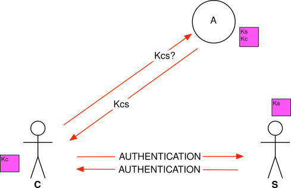
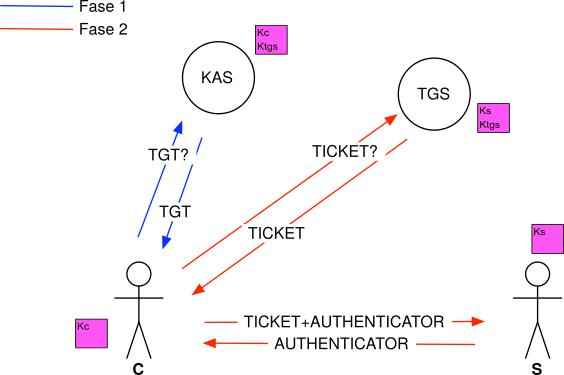

    Share this on &rarr;
    [<a title="Share on Mastodon" href="https://tootpick.org/#text=Check%20out%20https://sysfatal.github.io{{  page.url }}%20by%20@esoriano@social.linux.pizza">Mastodon</a>]
    [<a href="https://twitter.com/intent/tweet?text={{ page.title }}&url={{ site.url }}{{ page.url }}&via=e__soriano&related=e__soriano" rel="nofollow" target="_blank" title="Share on Twitter">Twitter</a>]
    [<a href="https://facebook.com/sharer.php?u={{ site.url }}{{ page.url }}" rel="nofollow" target="_blank" title="Share on Facebook">Facebook</a>]

 

---

<figure class="image">
  
 </figure>

 

En muchas charlas, blogs y artículos se describen
ataques en entornos corporativos Windows que usan el protocolo de
autenticación distribuida Kerberos.

Viendo esos ataques con nombres peculiares, no es raro que quede
cierta sensación de que el protocolo Kerberos es
inseguro: los famosos *golden tickets* (como el de Willy Wonka),
los *silver tickets*, etc.

Pero, ¿son ataques al protocolo Kerberos?

### Autenticación distribuida con Kerberos

Kerberos [1] fue una vuelta de tuerca a una idea anterior, el algoritmo
Needham-Schroeder [2]. El algoritmo Needham-Schroeder es básico para entender
Kerberos y otros protocolos de autenticación distribuida como Open ID/Oauth.

#### Needham-Schroeder

Este protocolo es muy antiguo, de 1978.
El objetivo principal de Needham-Schroeder es
solucionar el problema de la distribución de claves
en un sistema distribuido con múltiples clientes y servidores.
Involucra a un **Servidor de Autenticación**,
que **comparte un secreto con los clientes y servidores**.
De esta forma, todas las claves están centralizadas en el servidor
de autenticación, y cada actor conoce sólo su propia clave:
no tienen que compartir secretos todos con todos para poder autenticarse.

Cuando un cliente C se quiere autenticar ante el servidor S,
tienen que interactuar con ese nuevo servicio:
el servidor de autenticación A.
El objetivo es crear una **clave de sesión** (***Kcs***) que se usará sólo
para esta interacción entre C y S, después se descartará.

El esquema es el siguiente:

<figure class="image">
  
 </figure>

 

Tenemos que tener claro que las cajas de color fucsia de este esquema
contienen **secretos**. ***Kc*** es el secreto compartido entre
C y A, y ***Ks*** es el secreto compartido entre S y A.
Esos secretos permiten la autenticación de C con
A, de C con S y viceversa.

Simplificando, el protocolo funciona así:

1. C se autentica ante A usando ***Kc***, indicando que quiere autenticarse
ante el servicio S.
2. A comprueba que la petición de C es correcta, usando ***Kc***.
3. A crea una clave de sesión ***Kcs*** para que C y S la usen temporalmente.
4. A envía ***Kcs*** a C, junto con un mensaje cifrado que sólo S puede descifrar
(se necesitará ***Ks***).
5. C consigue ***Kcs*** y envía a S el mensaje que le dio A (y sólo S puede descifrar).
6. S consigue ***Kcs*** de dicho mensaje usando ***Ks***.
7. S crea un reto, lo cifra con ***Kcs*** y se lo envía a C.
8. C descifra el reto con ***Kcs***, lo decrementa, lo cifra de nuevo
con ***Kcs*** y se lo envía a S.
9. Una vez autenticados mutuamente, se comunican de forma segura usando ***Kcs***.

Básicamente, la idea es esta: A le da a C una cosa que es para S
(sólo S la puede descifrar).
Así, C y S conocerán ***Kcs*** (a uno le llega directamente y al otro indirectamente).

Este protocolo tenía sus problemas (ataques de replay si se comprometía
una clave de sesión, no usaba timestamps, etc.) pero sirvió de base
para los protocolos de autenticación modernos.

#### Kerberos

También es un protocolo antiguo (se desarrolló en 1983 en el MIT),
pero ha ido evolucionando y
tiene múltiples versiones (actualmente va por la versión 5.1.18).
Hay un consorcio que mantiene Kerberos como un
proyecto *open source*  y está definido en múltiples RFCs.

Kerberos separa el servicio de autenticación en dos servicios distintos.
En teoría, pueden ejecutar en dos nodos distintos, pero en la práctica
suelen ejecutar en la misma máquina llamada KDC (Key Distribution Center):

* **KAS** (Kerberos Authentication Server): su objetivo
	es autenticar al cliente. Para ello,
	comparte un secreto con cada cliente (***Kc***).
	También comparte un secreto con cada TGS (***Ktgs***).

* **TGS** (Ticket Granting Service):
	proporciona tickets a los clientes para
	acceder a los servidores de su dominio (o  realm).
	Puede haber distintos TGS para distintos dominios.
	Comparte un secreto con cada servidor de su dominio (***Ks***).

Kerberos es una evolución del protocolo Needham-Schroeder,
podemos verlo como dos iteraciones. El esquema es el siguiente:

<figure class="image">
  
 </figure>

 

De nuevo,
tenemos que tener claro que las cajas de color fucsia de este esquema
contienen **secretos**.

El protocolo usa dos objetos: ***tickets*** y ***authenticators***.
Los ***tickets*** llevan claves de sesión.
Los ***authenticators*** sirven
para autenticarse ante otro nodo usando la clave de sesión.
Esos objetos al final dependen de
los secretos compartidos mostrados en las cajas de color fucsia.

Al final, no es tan complicado: usa la misma idea que Needham-Schroeder,
pero en dos niveles. El ***KAS*** nos da tickets que nos permiten pedir tickets
a los ***TGS*** para acceder a los servidores de su dominio.
Podemos verlo como dos fases:

* Fase 1: conseguir un ***Ticket-Granting Ticket*** (***TGT***).
* Fase 2: conseguir un ticket para el servidor ***S*** usando
el Ticket-Granting Ticket.

El protocolo incluye timestamps y tiempos de validez dentro de los
mensajes cifrados, para evitar ataques
de replay como los que afectan a Needham-Schroeder.

El secreto de Kerberos depende del cifrado que se use.
Básicamente, los sistemas Windows pueden usar
tres familias (depende
de la versión/configuración): RC4-HMAC, DES o
AES. En todos los casos, el secreto de Kerberos
se deriva a partir de la contraseña de la cuenta. Dependiendo
del cifrado, se hace de forma diferente. Por ejemplo, en RC4-HMAC el
secreto es la hash NT tal cual (una hash MD4).
Con AES, se deriva usando
como salt el *realm* y el nombre de usuario, aplicando la KDF
PBKDF2 para conseguir una clave AES para después cifrar
una constante [8]. Evidentemente, es recomendable usar AES.

### Ataques populares

#### Pass the ticket

El ataque llamando *pass the ticket* consiste en robar el
***Ticket-Granting Ticket (TGT)*** del componente
de autenticación del sistema del cliente.

Este ticket, como hemos visto antes, permitirá
solicitar tickets para conectarse a otros servidores del dominio (durante
el tiempo marcado por su tiempo de vida).

En [3] puedes encontrar un buen ejemplo de este ataque en un
sistema Windows.

#### Pass the key

Esto consiste en comprometer el cliente C
para conseguir la clave  ***Kc*** y
así poder ejecutar el protocolo normalmente para solicitar un TGT
para acceder a los servicios.

Este ataque es similar al *pass the hash* cuando se usa el
protocolo NTLM.

#### Golden ticket

Los *golden tickets* son ***Ticket-Granting Tickets (TGTs) falsos***.
Para poder forjarlos, es necesario asaltar el KDC.
En redes Windows, el KDC es el Controlador de Dominio.

Si se puede acceder a las credenciales del KDC,
se pueden forjar TGTs falsos para el dominio.
Para ello, hay que conseguir la *KRBTGT hash*,
que es lo que hemos llamado ***Ktgs***.

Estos TGTs falsos son perfectamente funcionales, se crean como
los que genera el propio KAS. Además,
se pueden generar para usar con Kerberos criptografía más débil
que la establecida por omisión
(DES o RC4-HMAC en lugar de AES)
para realizar otro tipo de ataques.
Todavía peor, esos tickets falsos no incluyen
opciones extras relacionadas con políticas de
seguridad [4]. Este ataque compromete el dominio completo.

#### Silver ticket

De la misma forma, los *silver tickets* son tickets falsos
para acceder a un servidor (los proporcionados en la fase 2).
Estos tickets falsos se pueden forjar si se comprometen la
clave del servicio objetivo (***Ks***).

#### Kerberoasting

Consiste en extraer las credenciales
de tickets capturados. El ataque es posible en ciertas versiones
de Windows (y modos de compatibilidad hacia atrás) que usan
un cifrado débil (RC4-HMAC) [5].
En ese modo, se usa como ***Ks*** la hash NT de la contraseña
de la cuenta del servicio.

El ataque consiste en *crackear*
dicha hash intentando descrifrar el ticket. Para
ello se necesita conocer los nombres de los servicios (SPN) y
extraer el ticket desde LSASS.

#### ASREPRoasting

Este ataque [6] también se basa en romper las contraseñas
a partir de los mensajes de Kerberos en configuraciones particulares
de Windows: cuando no se requiere una preautenticación de Kerberos,
es posible solicitar el TGT sin autenticarse. Parte de la
respuesta del KAS viene cifrada con ***Kc***.
Este ataque consisten en intentar crackearla.

#### Bronze bit attack

Este ataque [7] usa las extensiones de Microsoft para Kerberos que permiten
delegación (S4U2self y S4U2proxy). Esas extensiones
se usan para que un servicio pueda
poder pedir tickets en nombre de un cliente
para acceder a otro servicio.

El objetivo del ataque
es que el atacante, que ha tomado el control de un servicio,
pueda autenticarse ante un segundo servicio
suplantando la cuenta de un usuario.

Este ataque necesita conocer el secreto de una cuenta
de un servicio (***Ks***), que además tenga permitida la delegación a otro
servicio (constrained delegation).
Así, el atacante es capaz de manipular
un ticket generado para  para cambiar las opciones de delegación.

### Pero... ¿son realmente ataques al protocolo Kerberos?

En el caso de

* *Kerberoasting*
* *ASREPRoasting*

estamos hablado
de intentar *crackear* la clave.
Esto depende de la criptografía usada (RC4-HMAC es lo ideal para
el atacante en este caso),
la calidad de las contraseñas y la potencia de cálculo del
adversario. En el segundo caso, el problema es la opción
de omitir la preautenticación.

Los siguientes ataques se basan exclusivamente en **robar los secretos**
que hemos visto en las cajas de color fucsia o los tickets:

* *Pass the ticket*
* *Pass the key*
* *Golden ticket*
* *Silver ticket*

Al final, un protocolo de autenticación se tiene que basar
en secretos de algún tipo.
Los extremos tienen que tener sus secretos
a buen recaudo. **Si el atacante consigue esos secretos, poco se puede hacer**.

Los secretos tienen que estar en la máquina (en la memoria
del componente de seguridad concreto, kernel, o donde sea)
para permitir la autonomía de los servicios.
Si no se guardaran en la memoria,
se necesitaría pedir algún secreto al usuario (p. ej. contraseña)
para derivar la clave
cada vez que se necesitara ejecutar el protocolo. Esto no es viable,
sobre todo en los servidores. Además, si
la máquina está comprometida hasta el punto de poder volcar
las credenciales de la memoria de los componentes de seguridad,
seguramente también se pueda
capturar ese secreto que introduce el usuario. El robo de claves
se puede poner más dificil usando HSMs o Smart Cards.
No obstante, al final un sistema tiene
que poder usar esos componentes de alguna forma.
Por tanto, si queda
totalmente comprometido, el atacante también podrá usarlos.

Estos ataques no se pueden considerar ataques
al protocolo de autenticación Kerberos, son ataques a las credenciales
del sistema.
De hecho,
MITRE CAPEC engloba estos ataques en el
patrón *Use of Known Credentials*
y MITRE ATT&CK en *Use Alternate Authentication Material*
y *Credential Access*.

Hay distintas herramientas para extraer las credenciales en una máquina
comprometida. El fichero que contiene las credenciales
(\windows\system32\config\sam), en teoría, está
bloqueado de forma continua.  
En la práctica, sí se pueden conseguir dichas credenciales si se
compromete la máquina. Entre las credenciales, se pueden encontrar
las hashes LM (muy inseguras,
no se deberían usar ya, pero se puede configurar el sistema
para usarlas para tener compatibilidad hacia atrás),
las hashes NT (no muy seguras, pero necesarias para NTLM),
material de Kerberos y las contraseñas cifradas con un algoritmo reversible
(si está activada dicha opción, que no es común).
Por ejemplo, en Windows 7 se puede usar la herramienta *pwdump7*.
En Windows 10, se pueden usar las herramientas *mimikatz* o *powerdump*.

Microsoft intenta ponerlo difícil:
desde Windows 10 Anniversary Update, SAM tiene un formato
distinto y se usa cifrado AES-CBC-128. En versiones antiguas,
el almacén SAM también podía estar cifrado con un método llamado *Syskey*.
Ambas protecciones (excepto Syskey con contraseña adicional en arranque)
se saltan el segundo principio de Kerckhoffts: la clave usada para cifrar
está en alguna parte del sistema y se puede encontrar (de hecho, se encuentra).

Como de costumbre, también hay problemas con la compatibilidad hacia
atrás y la posibilidad de activar opciones inseguras (p. ej. el
cifrado RC4-HMAC para Kerberos).
Microsoft tiene un problema serio con las credenciales:
como se ha comentado, en muchas instalaciones
se sigue usando la hash NT. Ya se ha comentado que es una
hash MD4, función que se considera obsoleta desde hace
mucho tiempo.
Además, no se usa salt para generar la hash a partir de la contraseña
del usuario, lo que abre la puerta a ataques con tablas precomputadas y
*rainbow tables*, etc.

El ataque *bronze bit attack* sí que es un ataque
al protocolo... pero, en este caso, a la extensión de Microsoft para
delegación en la autenticación.
Es un ataque que el atacante puede suplantar a otro usuario sin robar las
credenciales de dicho usuario o las del servicio atacado; lo hace robando las
credenciales de un tercero (otro servicio).
Microsoft ha sacado un parche para esta vulnerabilidad hace pocos días
(CVE-2020-17049).

### Referencias
[1] J. G. Steiner, B. C. Neuman, and J. I. Schiller, “Kerberos: An authentication
service for open network systems,” in Proceedings of the Winter 1988 USENIX
Conference, (Dallas, USA), USENIX Association, 1988.

[2] R. M. Needham and M. D. Schroeder, “Using encryption for authentication in
large networks of computers,” Commun. ACM, vol. 21, p. 993–999, Dec. 1978.

[3] J. Warren, “How to detect pass-the-ticket attacks,” https://stealthbits.com/blog/how-to-detect-pass-the-ticket-attacks/

[4] S. Duckwall and D. B., “Abusing kerberos.” https://www.blackhat.com/docs/us-
14/materials/us-14-Duckwall-Abusing-Microsoft-Kerberos-Sorry-You-Guys-
Don%27t-Get-It-wp.pdf

[5] S. Metcalf, “Cracking kerberos TGS tickets using kerberoast – exploiting kerberos
to compromise the active directory domain.” https://adsecurity.org/?p=2293

[6] harmj0y, “Roasting as-reps.” http://www.harmj0y.net/blog/activedirectory/roasting-
as-reps/ .

[7] J. Karnes, “Cve-2020-17049: Kerberos bronze bit attack overview,” 2020.
https://blog.netspi.com/cve-2020-17049-kerberos-bronze-bit-overview/

[8] MS-KILE: Kerberos Protocol Extensions
https://docs.microsoft.com/en-us/openspecs/windows_protocols/ms-kile/2a32282e-dd48-4ad9-a542-609804b02cc9

    <b>(cc) Enrique Soriano-Salvador</b>
    Algunos derechos reservados. Este trabajo se entrega bajo la licencia
    Creative Commons Reconocimiento - NoComercial - SinObraDerivada (by-nc-nd).
    Creative Commons, 559 Nathan Abbott Way, Stanford,
    California 94305, USA.

