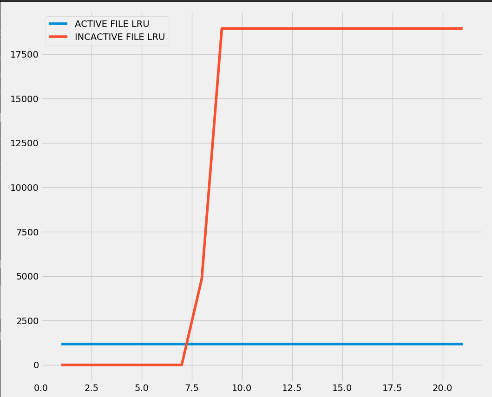
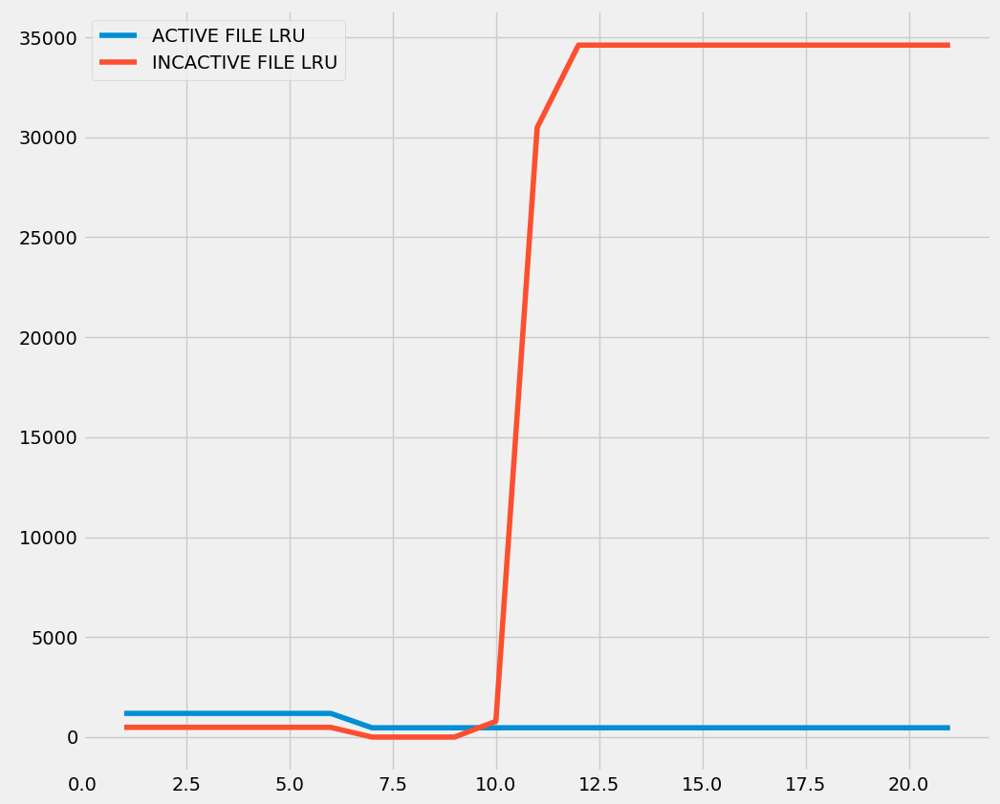
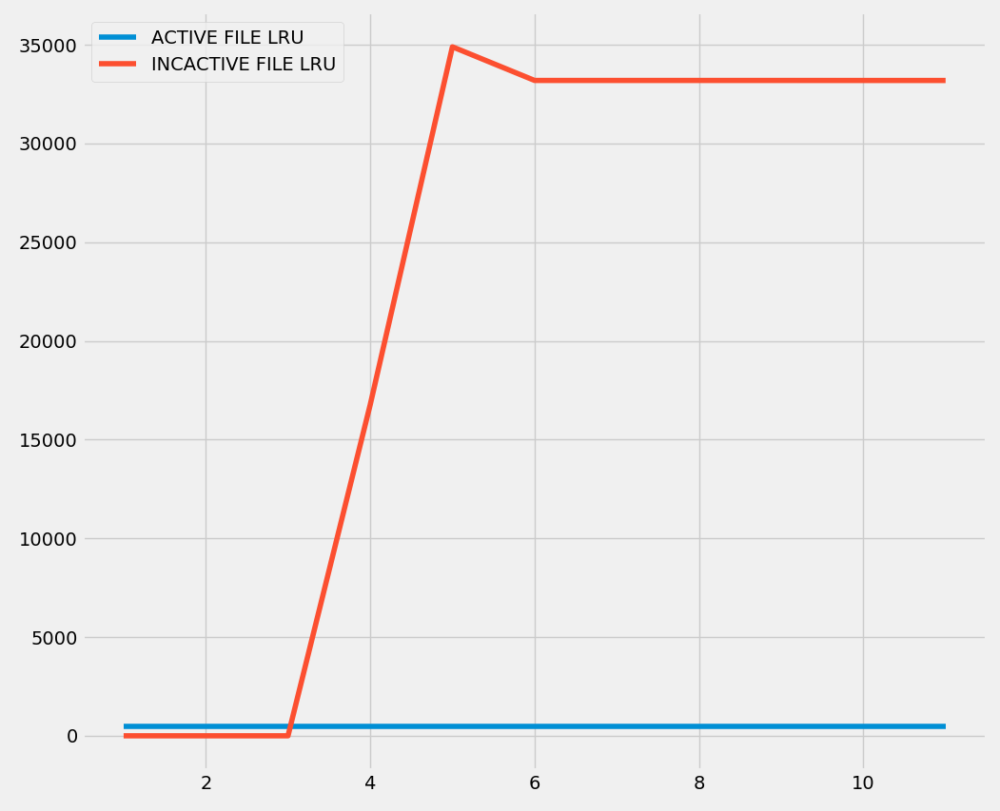
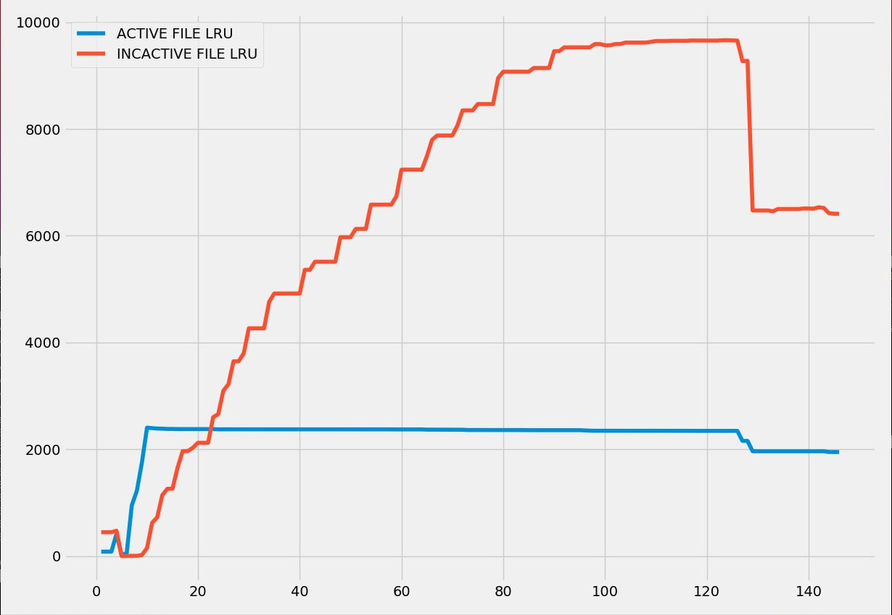
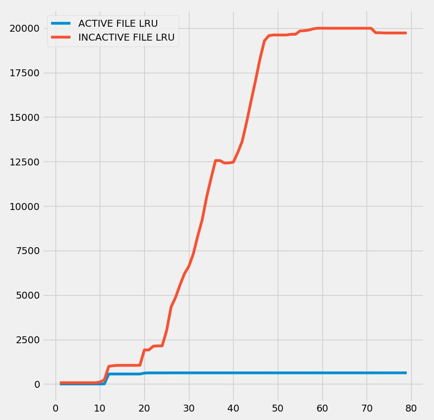
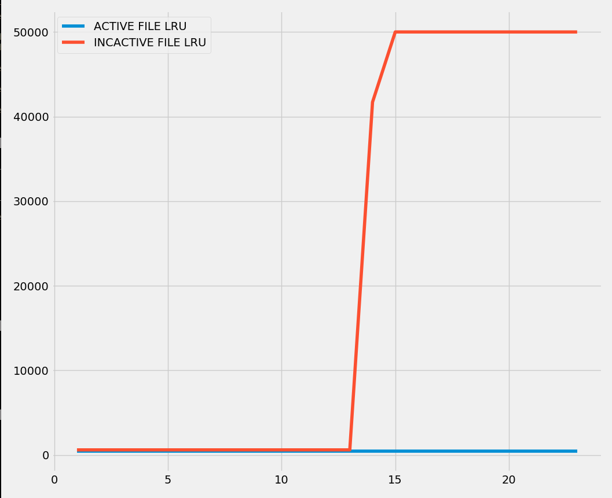

<div class="share-page">
    Share this on &rarr;
    [<a title="Share on Mastodon" href="https://tootpick.org/#text=Check%20out%20https://sysfatal.github.io{{  page.url }}%20by%20@esoriano@social.linux.pizza">Mastodon</a>]
   [<a href="https://twitter.com/intent/tweet?text={{ page.title }}&url={{ site.url }}{{ page.url }}&via=e__soriano&related=e__soriano" rel="nofollow" target="_blank" title="Share on Twitter">Twitter</a>]
    [<a href="https://facebook.com/sharer.php?u={{ site.url }}{{ page.url }}" rel="nofollow" target="_blank" title="Share on Facebook">Facebook</a>]
</div>
<br>

<center>
<figure class="image">
  
</figure>
</center>


Ransomware early detection tools try to detect a ransomware attack in order
to suspend all suspicious processes, stop the attack and try to recover the keys.
There are several systems for early detection, for example **UNVEIL** (*UNVEIL: A Large-Scale,
Automated Approach to Detecting Ransomware, Usenix Security, 2016*),
**RWGuard** (*RWGuard: A Real-Time Detection System Against Cryptographic Ransomware.
RAID 2018: Research in Attacks, Intrusions, and Defenses*),
**RLocker** (*R-Locker: Thwarting ransomware action through a honeyfile-based approach,
Computers & Security, March 2018*), etc.

When I read the UNVEIL paper some time ago, I liked the idea of computing the
entropy of the `write` system call buffers to detect ransomware attacks (what they
call *Filesystem Activity Monitor*).
The idea is simple: a ransomware process will read low entropy data (the user's files)
and write high entropy data (the encrypted data). This pattern can be exploited
to detect an attack. UNVEIL traces the IO operations at the file system layer,
to collect the processes, files, set of IO operations, and the entropy of the buffers.
Then, they try to detect patterns.

While thinking about this approach, I had a different idea: **how about
inspecting the system's page cache?** Upon a ransomware attack, the page cache
will be quickly populated with high entropy pages (i.e. the chunks of the files that are
being encrypted by the ransomware). So I decided to perform some experiments
with the Linux kernel.

## The tindalos module

The experiment is based on a Linux kernel module named **tindalos.ko**. This module
spawns a new kernel thread. This thread will do *polling*: periodically, it
iterates over the page cache, computing the Shannon entropy of the pages belonging
to files and counting the pages with more than 7.5 bits per byte. Easy, right?
Well, it's not trivial. The Linux page cache is pretty complex.

### LRUs

The page cache is a write-back cache. It uses a global replacement scheme based
on the LRU policy (Least Recently Used). It uses two lists: the active and the
inactive. The inactive list contains the pages that have not been recently used
and can be evicted (*cold* pages).
The active list contains the pages that have been recently
accessed (*hot* pages).
Those pages will be moved to the inactive list if they are not accessed.
When the page is allocated, it is added to the inactive list.

Linux uses different lists for different types of pages (anonymous, file pages, etc.).
The [lruvec structure](https://elixir.bootlin.com/linux/v5.14.21/source/include/linux/mmzone.h#L297)
contains all the LRU lists. We are interested in the LRU lists for file pages:
`LRU_ACTIVE_FILE` and `LRU_INACTIVE_FILE`.

To iterate over the list, you can use the `list_for_each` macro of the Linux kernel.
You must acquire the corresponding `spin_lock` (a member of the `lruvec` structure)
to iterate over the LRU lists.

How can I reach the LRU lists from the tindalos kernel thread?

### Memory cgroups and pglists

There is a `lruvec` for each cgroup (control groups, see the man page
*cgroups(7)*). The module accepts an argument to specify a PID. It will
inspect the memory cgroup of this process. If the argument is not provided,
it will inspect the kthread memory cgroup (the root mem_cgroup of the kernel).
We can get the process' mem cgroup with:

```
struct mem_cgroup *mem_cgroup_from_task(struct task_struct *p);
```

Once we have the `mem_cgroup`, we can get the `lruvec` with:

```
static inline struct lruvec *mem_cgroup_lruvec(struct mem_cgroup *memcg, struct pglist_data *pgdat)
```

We need to provide a pglist_data. What is that? This data structure represents a memory
bank. There is a `pglist_data` for each **NUMA** (*Non Uniform Memory Access*) node, and
only one if it is a UMA machine. You can find more info [here](https://www.kernel.org/doc/gorman/html/understand/understand005.html).
All nodes are available in a list, so we can iterate like this:

```
pg_data_t *pgdat;
struct lruvec *lruvec;
unsigned long flags;

for_each_online_pgdat(pgdat) {
	lruvec = mem_cgroup_lruvec(memcg, pgdat);
	printk(KERN_INFO "Tindalos thread: lruvec: %p\n", lruvec);
	spin_lock_irqsave(&lruvec->lru_lock, flags);
	searchlruvuc(lruvec, st, headlen);
	spin_unlock_irqrestore(&lruvec->lru_lock, flags);
}
```

First problem: we need to acquire the spin lock (disabling interrupts)
to inspect the LRU list.
This is **very expensive** and not viable in general (but this is just an experiment!).
We are not able to inspect the whole LRU list (it can be huge on a modern machine).
We will analyze the first N pages of the list (from the head). The tindalos
module admits an argument to set that parameter (`headscan`).

### Entropy

We need to compute the Shannon entropy of the pages. Bad news: we should not
use the Floating Point (FP) within the kernel. We need to do it with integers.

Fortunately, we can borrow an implementation (`fs/btrfs/compression.c`) and
modify it for our module:

```
static inline uint32_t ilog2_w(uint64_t n)
{
	return ilog2(n * n * n * n);
}

static uint32_t count[256];

static uint32_t shannon_entropy(uint8_t *buf, int sz)
{
	const u32 entropy_max = 8 * ilog2_w(2);
	u32 entropy_sum = 0;
	u32 p, p_base, sz_base;
	u32 i;

	memset(count, 0, sizeof(count));
	for(i=0; i<sz; i++){
		count[buf[i]]++;
	}
	sz_base = ilog2_w(sz);
 	for(i=0; i<256; i++){
		p = count[i];
		if(p > 0){
			p_base = ilog2_w(p);
			entropy_sum += p * (sz_base - p_base);
		}
	}
	entropy_sum  = entropy_sum * 100 / sz;
	return entropy_sum / entropy_max * 8;
}
```

This function returns the Shannon entropy (bits per byte) scaled x100.
All the pages with `shannon_entropy` > 750 will be counted by
the tindalos kthread.

## Experiments

I implemented a simple C program named `ransim.c` that simulates a
ransomware attack. This program implements the three ransomware classes defined
by Scaife et al. (*CryptoLock (and Drop It): Stopping Ransomware Attacks on User Data, 2016 IEEE 36th International Conference on Distributed Computing Systems (ICDCS)*):

* Class A: "overwrites the contents of the original
file by opening the file, reading its contents, writing the
encrypted contents in-place, then closing the file"

* Class B: "extends Class A,
with the addition that the malware moves the file out of the
user’s documents directory (e.g., into a temporary directory).
It then reads the contents, writes the encrypted contents, then
moves the file back to the user’s directory"

* Class C: "reads the original file, then creates a new,
independent file containing the encrypted contents and deletes
or overwrites (via a move) the original file"

This program does not encrypt the files; it just writes random
data (extracted from `/dev/urandom` via *getrandom(3)*) to the
attacked files (random data and encrypted data should have entropy ~ 8.0).

All the experiments run on a VirturalBox Ubuntu 20.04 virtual machine.

### Experiment: Class-[ABC] simulation

We copy /usr/include to a directory and run `ransim.c` to "encrypt" all the files:

```
$> cp -r /usr/include/ testing/
$> ./ransim class-a testing/include/
testing/include/ will be destroyed, proceed? (type 'yes')
yes
$>
```

Then, we load the tindalos module to poll the page cache every 2 seconds and
inspect the first 50000 pages of each LRU:

```
$> insmod tindalos.ko pidmemgroup=2093 polltime=2000 headscan=50000
```
This is the result for the Class A simulation:

<center>
<figure class="image">
  
</figure>
</center>

The graph shows the number of high entropy (>7.5) pages for each LRU.

With the same settings, this is the Class B simulation:

<center>
<figure class="image">
  
</figure>
</center>

And this is the Class C simulation:

<center>
<figure class="image">
  
</figure>
</center>

All of them causes a delta in the inactive LRU graph. The pages
are allocated and never touched again, so they are not moved to
the active LRU.

The pattern is clear.

But...

### Experiment: normal usage

Does "normal usage" cause similar patterns? It shouldn't, but...
wait. Encrypted data have high entropy, but compressed data also
have high entropy.

This graph shows a common browser session visiting YouTube and
Reddit (using Firefox):

<center>
<figure class="image">
  
</figure>
</center>

It's not a delta, but it (slowly) fills the inactive list with high entropy
pages.

If we download the Linux kernel source tarball with Firefox:

<center>
<figure class="image">
  
</figure>
</center>

Closer.

If we copy this tarball to another file:

```
$ cp linux-4.19.252.tar.xz /tmp/l2
```

<center>
<figure class="image">
  
</figure>
</center>

It makes sense. Copying any compressed file will populate the inactive
list with high entropy pages, generating the same pattern than
the ransomware attack.

Compressed data is ubiquitous and files are huge (browser data, software
packages, etc.).

**Quick conclusion: The approach is not viable.** There will be a lot of
false positives. Is it worth to keep going? I do not think so.

You can find the source code of this experiment here:

[https://gitlab.etsit.urjc.es/esoriano/tindalos](https://gitlab.etsit.urjc.es/esoriano/tindalos)


### Comments

You can comment this post in this [tweet](https://twitter.com/e__soriano/status/1547519452119449600)

<sub><sup>
    <b>(cc) Enrique Soriano-Salvador</b>
    Creative Commons  (by-nc-nd).
    Creative Commons, 559 Nathan Abbott Way, Stanford,
    California 94305, USA.
    <br>
    <i>Except the cool Hound of Tindalos picture</i>
</sup></sub>
