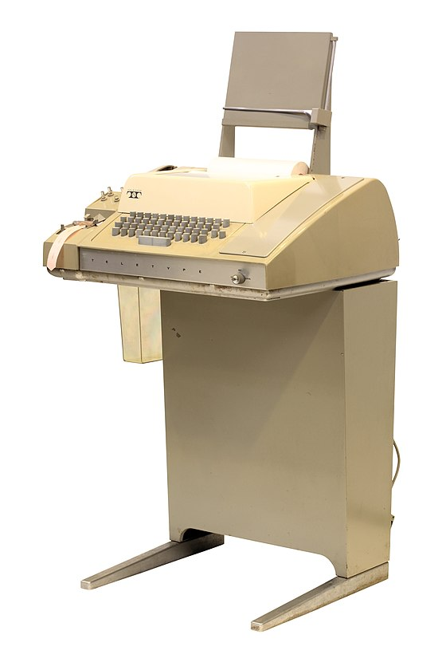
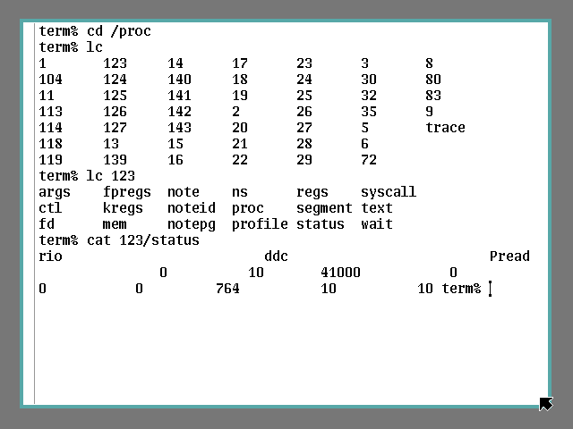

<div class="share-page">
    Share this on &rarr;
    [<a title="Share on Mastodon" href="https://tootpick.org/#text=Check%20out%20https://sysfatal.github.io{{  page.url }}%20by%20@esoriano@social.linux.pizza">Mastodon</a>]
    [<a href="https://twitter.com/intent/tweet?text={{ page.title }}&url={{ site.url }}{{ page.url }}&via=e__soriano&related=e__soriano" rel="nofollow" target="_blank" title="Share on Twitter">Twitter</a>]
    [<a href="https://facebook.com/sharer.php?u={{ site.url }}{{ page.url }}" rel="nofollow" target="_blank" title="Share on Facebook">Facebook</a>]
</div>
<br>

<center>
<figure class="image">
  
  <figcaption> Teletipo ASR33 </figcaption>
</figure>
</center>


Como decía Lions en su libro "A Comentary on the UNIX Operating System"
[1], en 1977 ya había
una gran cantidad de terminales disponibles de distinto tipo que podían ser
conectados a un ordenador. Sus características principales eran:

* Velocidad de transmisión. Por ejemplo, un teletipo ASR33 era de 100 baudios
o un Visual Display Unit (VDU) de 9600 baudios. ¿Baudios? Como dice la wikipedia,
el baudio (Bd) es una _unidad de transmisión de datos que se usa para referirse
a la velocidad de las señales, específicamente, representa la cantidad de veces
que una señal cambia por segundo_.

* Paridad de transmisión, que puede ser _odd_, _even_, _none_, o _inoperative_.  ¿Qué
es eso? Es un bit de redundancia para detectar errores. Si has visto el ASR33, te puedes
imaginar por dónde tenían que viajar los bits hasta llegar al ordenador, y al
revés. Era fácil que un bit se cambiara por el camino.
Por ejemplo, si es odd (impar), si el número de bits transmitidos es par,
el bit de paridad se pone a 1, para que la cuenta total sea impar; si el número
es impar, se pone a 0 para que la cuenta total sea impar.

* Conjunto de caracteres que puede representar. Por ejemplo, si puede representar
toda la tabla ASCII, etc.

* Otros detalles, como si se combina el retorno de carro con la nueva línea,
si el terminal es full duplex o half duplex (esto es, si pueden transmitir datos
en los dos sentidos a la vez o no), algunas funciones de control, etc.

Una de las características es su técnica de salida.
¿Estás pensando en pantallas? Puede que no sea una pantalla.
Mira el teletipo ASR33, su salida es una impresora. Ese dispositivo
es un **teletipo**.

Cuando apareció la línea de comandos, sustituyendo los trabajos
por lotes (no en todos los casos), se empezaron a conectar todo tipo de teletipos
a los ordenadores para hacer entrada/salida. Es lo que había en el mercado entonces.
El los años 1970s se empezaron a usar terminales de video como el VT100 de DEC [2].

<center>
<figure class="image">
  
  <figcaption> DEC VT100 </figcaption>
</figure>
</center>

Desde hace varias décadas no usamos dispositivos hardware de este tipo: lo que tenemos
es un ordenador con su teclado y pantalla.
Sin embargo, en los sistemas de tipo Unix, como Linux y OSX, todo esto
está metido en las profundidades del sistema.
Usamos terminales _virtuales_
que no están conectados por un par de cables a un teclado y una impresora o pantalla.
¿Nunca te has preguntado por qué se habla de TTY cuando hacemos referencia al terminal?
TTY significa **teletype terminal**.

Todos sabemos (o deberíamos saber) que unas de las ideas originales de Unix es que
(casi) todo se representa como un fichero, que no tiene por qué ser una serie
de bloques en un disco duro: hay ficheros _sintéticos_ que sirven de interfaz
con el núcleo del sistema.

El fichero */dev/tty* siempre representa el terminal controlador de un proceso
(si es que tiene). Siempre que abras ese fichero, estás abriendo tu terminal controlador.
Como se indica en la página de manual _tty(4)_, ese fichero
representa un dispositivo de caracteres:

```
$ ls -l /dev/tty
crw-rw-rw- 1 root tty 5, 0 jul 19 09:22 /dev/tty
```

En una máquina Linux tenemos dispositivos de caracteres para los terminales,
con el nombre */dev/ttyX*, siendo X un número. Estos son terminales _virtuales_.

Los terminales serie se llaman */dev/ttySX*, siendo X un número. Son puertos
UART para conectar terminales de verdad por un cable serie. Hay muchos otros
tipos de ficheros tty en */dev/*, para hardware específico (p. ej. puertos
_stallion_, _specialix_, etc.)... en mi sistema, hay 98:

```
$ ls /dev/tty* | wc -l
98
```

Los teletipos se conectaban a través de un par de cables a
una UART (Universal Asynchronous Receiver and Transmitter).
El driver de la UART gestiona la transmisión por este cable serie.
Otro driver implementa el terminal, leyendo/escribiendo en la UART.

El driver del terminal era extremadamente importante, porque
los terminales eran la interfaz del usuario con el sistema.
El driver puede manejar la entrada en dos
modos: canónico y no canónico.  El modo se indica en la
flag `ICANON` de la configuración del terminal.

En modo no canónico, la entrada del terminal se procesa
carácter a carácter.
Esta no es la forma en la que estamos acostumbrados a usar un terminal.
Las aplicaciones como editores (p. ej. vi, nano) usan la entrada en modo
no canónico, porque esos programas quieren ningún tipo de preprocesado
para el manejo de las líneas, etc.
En modo no canónico se configuran dos parámetros para decidir
cuando una lectura en el
terminal se debe completar: el tiempo y la cantidad de mínima
de caracteres que hay en la cola.
Si ambas están a cero, se hace _polling_: si hay un carácter disponible, se
entrega, y si no se retornan 0 bytes con error `EAGAIN`. Si la cantidad mínima
está establecida y el tiempo es cero, es una lectura bloqueante normal.
Si el mínimo es cero y el tiempo está establecido, es una lectura con _timeout_.
Tienes más detalles en [6] y [7].

El modo canónico es el que estamos acostumbrados a usar.
Con el fin de mantener los programas de área de usuario lo más
sencillos posible (filosofía Unix), el sistema permite realizar
operaciones de edición sobre
las líneas que el usuario va escribiendo en el terminal, antes de que esas
líneas sean entregadas al programa en cuestión (p. ej. a la shell). Originalmente,
esto lo tenían que hacer las aplicaciones. Después, como casi todas las aplicaciones
necesitaban implementarlo, se metió dentro del kernel. Por tanto,
el sistema ofrece un buffer de edición y algunos comandos básicos para poder
cambiar las líneas antes de ser entregadas a la aplicación.
En este modo, la entrada del terminal
se trata línea a línea.
También se hace eco del terminal: lo que escribes con el teclado
también se escribe en la salida (p. ej. pantalla).
La *disciplina de línea* es la parte del driver que
implementa todo ese procesado (es como lo implementaban la mayoría de
los sistemas UNIX).
Lo puedes ver como lo que hay
entre las llamadas al sistema *read*/*write* manejadas por el driver del terminal,
que se realizan para leer/escribir desde área de usuario, y el driver del
dispositivo de entrada/salida que se esté usando.

Cuando se lee del terminal en modo canónico,
el  *read* se queda bloqueado hasta que haya una línea lista
para ser leída o se haya llegado al máximo de bytes que se han solicitado.
¿Qué significa que haya una línea? Significa que se haya encontrado un _carácter_
terminador de línea: una nueva línea, el final del fichero, un final de línea, etc.
Por tanto, hay _"caracteres"_ que tienen un significado especial.
POSIX.1 espeficia 11 caracteres especiales [6].
Ten en cuenta, además, que todo esto está totalmente relacionado
con el control de trabajos y sesiones.

Por ejemplo, cuando pulsamos Ctrl+D se completa la lectura actual: si hay
datos en el buffer, se entregan (aunque no sea una línea),
en otro caso se provoca un *read* de 0 bytes, que en Unix
se debe interpretar como final de fichero.
Cuando pulsamos Ctrl+C, se interpreta un "carácter de interrupción"
(que se traduce en una señal SIGINT para el proceso que está en primer plano);
Ctrl+Z se interpreta como una "caracter de suspensión", enviando la señal
SIGTSTP que hace que se pare el proceso que está en primer plano; Ctrl+U
se interpreta como un "carácter KILL" que elimina la línea que estamos
escribiendo; el carácter `'\n'` es una nueva línea; el carácter `'\r'` es un
retorno de carro; Ctrl+S para la entrada, la deja congelada; Ctrl+Q inicia
la entrada (la descongela); Ctrl+H borra un carácter de la línea; Ctrl+W
borra una palabra de la línea, etc.

Como es habitual en los sistemas de tipo Unix,
hay bastante lío con los nombres y se mezclan conceptos de diferentes
implementaciones y familias.
Se suele usar el término modo _cocinado_ cuando nos referimos al
modo canónico (i.e. uso interactivo del terminal)
y el término _crudo_ cuando nos referimos al modo no
canónico (i.e. sin ningún tipo de preprocesado).
En UNIX Version 7 se usaban esos nombres.
Algunos autores usan esos términos como sinónimos (p. ej. Tanembaum [8]).
Existen otros modos. Por ejemplo, _cbreak_
es algo intermedio: se lee carácter a carácter, pero sí se interpretan
ciertos caracteres de control.

Siendo precisos, al final lo que tenemos en Linux
es un conjunto de parámetros
de configuración para el terminal (entre los que se
encuentra la flag `ICANON`). Los modos _cocinado_ y _crudo_
son combinaciones diferentes de esos parámetros.

Las funciones de _termios(3)_ nos permiten controlar los parámetros
del terminal.
El comando _stty(1)_ nos permite consultar y cambiar la configuración del
terminal. Con el argumento `-a` nos da toda la información sobre el terminal:

```
$ stty -a
speed 38400 baud; rows 42; columns 75; line = 0;
intr = ^C; quit = ^\; erase = ^?; kill = ^U; eof = ^D; eol = <undef>;
eol2 = <undef>; swtch = <undef>; start = ^Q; stop = ^S; susp = ^Z;
rprnt = ^R; werase = ^W; lnext = ^V; discard = ^O; min = 1; time = 0;
-parenb -parodd -cmspar cs8 -hupcl -cstopb cread -clocal -crtscts
-ignbrk -brkint -ignpar -parmrk -inpck -istrip -inlcr -igncr icrnl ixon
-ixoff -iuclc -ixany -imaxbel iutf8
opost -olcuc -ocrnl onlcr -onocr -onlret -ofill -ofdel nl0 cr0 tab0 bs0 vt0
ff0
isig icanon iexten echo echoe echok -echonl -noflsh -xcase -tostop -echoprt
echoctl echoke -flusho -extproc
```

Como se puede ver en su salida, este terminal va a 38400 baudios, tiene 42
filas y 75 columnas de texto. Los caracteres que entiende son Ctrl+C
para interrumpir, Ctrl+U para _matar_ la línea (no confundas esto con
una señal SIGKILL), etc. También tiene activo el modo canónico (`icanon`).

Podemos ponerlo en modo crudo y después ver si podemos interrumpir
al proceso en primer plano con Ctrl+C:

```
$ stty raw
$ sleep 10
^C^C^C^C^C^C
```

¿El Ctrl+C mata al proceso que ejecuta *sleep*? No. No se envía la señal
SIGINT. El terminal está en modo crudo y Ctrl+C simplemente escribe el carácter
`^C` en el terminal.

Como dice la página de manual _stty(1)_, el modo _raw_ (_crudo_) es lo mismo que este
conjunto de parámetros: `-ignbrk -brkint -ignpar -parmrk  -inpck  -istrip  -inlcr
 -igncr  -icrnl  -ixon  -ixoff -icanon -opost -isig -iuclc -ixany
 -imaxbel -xcase min 1 time 0`. Como se puede observar, entre otras cosas,
desactiva `icanon`.

Si lo ponemos en modo _cooked_ (_cocinado_) y hacemos la misma prueba

```
$ stty cooked
$ sleep 10
^C
$
```

veremos que ahora sí se interrumpe el proceso que ejecuta el comando *sleep*.

El modo _cooked_ es este conjunto de parámetros:
`brkint ignpar istrip icrnl ixon opost isig icanon` y los caracteres
EOL y EOF puestos a su valor por omisión. Como se puede ver, activa
la flag `icanon`.

En otros sistemas de tipo Unix el comando *stty* es diferente (p. ej. [esta](https://man.freebsd.org/cgi/man.cgi?query=stty&apropos=0&sektion=0&manpath=FreeBSD+13.2-RELEASE+and+Ports&arch=default&format=html)
es la página de manual en FreeBSD).

Muchos programas cambian su comportamiento dependiendo si tienen
su entrada o en su salida un terminal. Pueden comprobarlo llamando a la
función _isatty(3)_.
Por eso estas dos ejecuciones de *ls* no provocan la misma salida:

```
$ ls
esoriano  lost+found
$ ls | cat
esoriano
lost+found
$
```

En el primer caso, la salida estándar es un terminal y *ls* escribe diferentes
columnas. En el segundo caso, la salida estándar es un pipe y se escriben
las entradas de directorio una por línea.

Lo mismo ocurre con los colores, ¿nunca te has preguntado por qué en los
terminales ves algunas cosas en distintos colores?

Al principio había teletipos básicos y luego fueron apareciendo terminales
de video cada vez más avanzados (1970s). Dichos terminales comenzaron a tener diferentes
colores, y aceptaban códigos para manipularlos. El American Standards Institute
(ANSI) estandarizó dichos códigos para controlar los terminales de video,
hasta ese momento cada terminal usaba sus códigos.

Por ejemplo, si queremos poner la letras amarillas:

```
$ echo $'\x1b[1;33m'
```

¿Qué hace esto? Estamos escribiendo en el terminal
el byte 0x1b (el carácter de escape,`esc`)
seguido de un código ANSI. El terminal interpreta eso como la orden
para cambiar el color del texto a amarillo.
De la misma forma podemos cambiar el fondo de la letra, si está en negrita,
etc.

Los códigos no son sólo para los colores. Se puede mover el cursor,
etc. Por ejemplo, `\x1b[2J` borra toda la pantalla.

Por eso, cuando no tenemos cuidado con lo que escribimos en el terminal, podemos
destrozar su configuración. Eso suele pasar cuando, sin querer, volcamos
un fichero binario en el terminal (p. ej. con *cat*).

Para restablecer los
valores del terminal podemos usar el comando _reset(1)_, que vuelve a ponerlo
en modo cocinado y con eco, y pone los valores por omisión.


# Pseudoterminales

Si en el terminal que estoy usando ahora mismo en mi máquina con Ubuntu 22.04
miro los descriptores de fichero de la shell que estoy usando (una bash en este
caso), podré ver:

```
$ ls -l /proc/$$/fd
total 0
lrwx------ 1 esoriano esoriano 64 jul 19 13:35 0 -> /dev/pts/0
lrwx------ 1 esoriano esoriano 64 jul 19 13:35 1 -> /dev/pts/0
lrwx------ 1 esoriano esoriano 64 jul 19 13:35 2 -> /dev/pts/0
```

Vemos que la entrada estándar, la salida estándar y la salida de errores (descriptores
0, 1 y 2) están usando el mismo fichero: */dev/pts/0*:

```
$ ls -l /dev/pts/0
crw--w---- 1 esoriano tty 136, 0 jul 19 13:38 /dev/pts/0
```

¿Qué es eso? PTS significa *pseudoterminal slave*. Estamos usando pseudoterminales.
Los terminales que estamos usando son terminales emulados, un programa con una
interfaz gráfica que simula un terminal hardware de los que se usaban hace décadas.
Hay muchos programas de este tipo:  *xterm*, *gnome-terminal* o *konsole*, etc.
Por ejemplo, cuando se escribe un código ANSI para cambiar el color de los
caracteres, es el emulador de terminal el que interpreta ese código y se pone
a _pintar_ los caracteres de otro color.

El comando _tty(1)_ nos dice la ruta al terminal en el que estamos:

```
$ tty
/dev/pts/0
$
```

Si en ese terminal ejecutamos

```
$ cat /dev/tty
```

el programa *cat* leerá de ese fichero */dev/tty*. Ese fichero
representa la consola para el proceso que está ejecutando *cat*.

Si en otro terminal escribimos en el fichero */dev/pts/0*

```
$ tty
/dev/pts/2
$ echo hola > /dev/pts/0
```

observaremos como el cat lee el `hola` que acabamos de escribir. También
podemos borrar todo lo que hay en ese terminal usando el código ANSI
que hemos visto antes:


```
$ echo $'\x1b[2J' > /dev/pts/0

```

Por cada pseudoterminal, hay un fichero que lo representa.
Cada vez que ejecutamos un emulador de terminal, aparece un nuevo pseudoterminal
en */dev/pts*. El nombre de fichero es un número que se va incrementando:

```
$ ls -l /dev/pts/
total 0
crw--w---- 1 esoriano tty  136, 0 jul 19 13:38 0
crw--w---- 1 esoriano tty  136, 1 jul 19 13:29 1
crw--w---- 1 esoriano tty  136, 2 jul 19 13:29 2
...
```

Como se describe en la página de manual _pts(4)_, el fichero
*/dev/ptmx* sirve para crear nuevos pseudoterminales. Los
pseudoterminales están descritos en la página de manual _pty(7)_.
Un pseudoterminal es un par de dispositivos de caracteres que
ofrecen un canal de comunicación bidireccional. Un extremo del
canal se llama _master_ y el otro _slave_.

El _slave_ ofrece la interfaz clásica de un terminal. Los programas
que esperan encontrarse un terminal, pueden abrir ese fichero y trabajar
con él. Los programas que emulan un terminal, como *xterm*,
tendrán que abrir el _master_ para hacer lo que corresponda (p. ej. _pintar_
cosas en esa ventana de la interfaz gráfica como si fuera una pantalla o
una impresora de los antiguos teletipos).

En Linux, todo esto lo proporciona el sistema de ficheros *devpts*, incluído
en 1997, que implementa lo que se conoce como pseudoterminales Unix98.
Podemos observar tenemos montado en */dev/pts*:

```
$ mount | grep devpts
devpts on /dev/pts type devpts (rw,nosuid,noexec,relatime,gid=5,mode=620,ptmxmode=000)
```

Se pueden tener diferentes instancias montadas en el sistema, con pseudoterminales
independientes. Esto es útil para tener contenedores.
Por eso, *devpts* ofrece el fichero *ptmx* en su raíz (ese es el _master_ para
esa instancia).

Si lanzamos una imagen de Docker, dentro del contenedor veremos:

```
root@6fb8780bda6e:/# cd /dev
root@6fb8780bda6e:/dev# ls -l ptmx
lrwxrwxrwx 1 root root 8 Jul 20 10:49 ptmx -> pts/ptmx
root@6fb8780bda6e:/dev# mount | grep devpts
devpts on /dev/pts type devpts (rw,nosuid,noexec,relatime,gid=5,mode=620,ptmxmode=666)
devpts on /dev/console type devpts (rw,nosuid,noexec,relatime,gid=5,mode=620,ptmxmode=666)
root@6fb8780bda6e:/dev#
```

Por tanto, dentro de ese contenedor se está usando una instancia diferente
de *devpts*. Si hacemos lo mismo fuera del contenedor:

```
$ ls -l /dev/ptmx
crw-rw-rw- 1 root tty 5, 2 jul 20 10:53 /dev/ptmx
```

Ahí, */dev/ptmx* no es un enlace simbólico al fichero *ptmx* de la instancia.
Se está usando el fichero *ptmx* global. Para poder usar efectivamente múltiples
instancias de *devpts*, en el contenedor se hace esto [5]:

```
$ chmod 0666 /dev/pts/ptmx
$ rm /dev/ptmx
$ ln -s pts/ptmx /dev/ptmx
$ ns_exec -cm /bin/bash
# We are now in new container
$ umount /dev/pts
$ mount -t devpts -o newinstance lxcpts /dev/pts
$ sshd -p 1234
```

Antes de *devpts*, Linux seguía el estilo antiguo de BSD para los pseudoterminales,
que se nombrabab como */dev/ptypX*, siendo X un número.

Todo esto en sorprendente, ¿verdad?
**Para poder ejecutar una shell en nuestros portátiles de última generación,
tenemos que emular hardware que lleva décadas obsoleto**.
Nuestros teléfonos móviles llevan dentro todo este código
y nos podemos conectar a ellos por un USB serie ¡como si nuestro portátil
fuera un *teletipo*!
Si tienes valor, lee la página de manual _xterm(1)_.

<center>
<figure class="image">
  
  <figcaption> Terminal de Plan 9, nada de teletipos </figcaption>
</figure>
</center>


Plan 9, el sistema sucesor de UNIX que, por desgracia, no
triunfó (esa es otra historia), limpió todo esto hace más de 30 años:
el sistema estaba diseñado para ejecutar en una máquina con teclado, ratón
y pantalla gráfica. El concepto de *teletipo*, o TTY, había desaparecido [4]...
pero no por mucho tiempo.

<center>
<figure class="image">
  
  <figcaption> DEC VT220 </figcaption>
</figure>
</center>

Aquí seguimos, emulando terminales de la familia VT de DEC en 2023.

# Referencias

[1] A Comentary on the UNIX Operating System. John Lions.

[2] The TTY demystified, https://www.linusakesson.net/programming/tty/index.php

[3] devpts, https://en.wikipedia.org/wiki/Devpts

[4] Plan 9 from Bell Labs, https://doc.cat-v.org/plan_9/4th_edition/papers/9

[5] devpts: Make each mount of devpts an independent filesystem, https://lwn.net/Articles/689539/

[6] Advanced Programming in the UNIX environment 2nd Ed., Stevens and Rago.

[7] The Linux Programming Interface, Kerrisk.

[8] Modern Operating Systems 4th Ed., A. Tanembaum.

<sub><sup>
    <b>(cc) Enrique Soriano-Salvador</b>
    Algunos derechos reservados. Este trabajo se entrega bajo la licencia
    Creative Commons Reconocimiento - NoComercial - SinObraDerivada (by-nc-nd).
    Creative Commons, 559 Nathan Abbott Way, Stanford,
    California 94305, USA.
</sup></sub>
